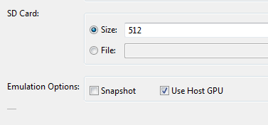
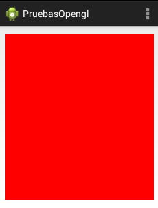

OpenGL: fundamentos
====================

Introducción a OpenGL
-----------------------

Debido a la amplia utilización de gráficos en dispositivos electrónicos ha crecido la necesidad de disponer de hardware especializado que pueda acelerar el dibujado de imágenes en dispositivos electrónicos. Este hardware especializado ofrece un conjunto de funciones ya programadas para poder realizar el dibujado. En PC's existen dos grandes conjuntos de funciones o APIs

* OpenGL: arrancó como un estándar "de facto" y a día de hoy se sigue considerando el API a seguir.
* DirectX: en el mundo Microsoft se ha convertido en un gran competidor.

En el desarrollo para móviles Android, OpenGL sigue siendo el único gran estándar y será el que se vea en este curso.

A fecha de hoy existen dos grandes versiones de OpenGL

* OpenGL: el estándar para dispositivos con capacidades de gama media/alta. Dentro de OpenGL la versión más actual es la 4.4.
* OpenGL ES: para "sistemas embebidos" (Embedded Systems), una versión reducida para móviles y tablets. La versión más actual es la 3.0, aunque en este curso se verá la 2.0, ya que en la actualidad apenas hay dispositivos que soporten la 3.0.

Probando los programas OpenGL
------------------------------

Cuando se crean programas pueden probarse de dos formas

1. Disponiendo de un dispositivo Android con capacidades de aceleración OpenGL.
2. Utilizando un emulador al cual se le ha activado "Use Host GPU".

En la imagen adjunta puede verse que a la hora de crear un emulador se puede activar una casilla con ese nombre. En realidad no importa si nuestro PC no tiene tarjeta gráfica aceleradora ya que en ese caso, el driver del PC "emulará" el comportamiento de una aceleradora. Es decir, puede que vaya lento, pero funcionará.

   
   Activando la aceleración gráfica

Inicializando OpenGL
----------------------

OpenGL 2.0 está disponible en la mayor parte de dispositivos actuales, aunque podría ocurrir que un usuario que ejecutara nuestra aplicación no dispusiera de él. Para controlar esta situación se pueden hacer dos cosas:

1. Que nuestra aplicación exija ejecutarse en un entorno que disponga de OpenGL.
2. Comprobar que versión de OpenGL está disponible y en función de la versión actuar de una forma u otra.

La segunda es la más flexible pero implicaría crear diferentes versiones de nuestro programa para OpenGL 2.0, para 1.0 y para el caso de que no hubiera ninguna. 

Por ejemplo, podemos ejecutar este método para determinar qué versión de OpenGL tiene el hardware en el que se ejecuta nuestra app.

.. code-block:: java

	public String getVersionOpenGL(){
		ActivityManager manager=
				(ActivityManager) this.getSystemService(Context.ACTIVITY_SERVICE);
		ConfigurationInfo configInfo=
				manager.getDeviceConfigurationInfo();
		return configInfo.getGlEsVersion();
	}
	
¡Cuidado, este código siempre devuelve 0.0 en los emuladores!.

Por otra parte, en este curso nos limitaremos a la primera opción comentada: exigir que el hardware en el que se ejecute tenga al menos OpenGL 2.0 y si no denegar incluso la instalación. Esto puede conseguirse añadiendo al ``AndroidManifest.xml`` la línea siguiente:

.. code-block:: xml

	<uses-feature android:glEsVersion="0x00002000"/>
	
Clases necesarias
-------------------

En Android necesitaremos al menos dos clases:

1. Una de ellas actuará como contenedor, es decir será el control donde se dibuje todo. Este "contenedor" puede ser la clase SurfaceView o la TextureView.
2. La otra clase será la que se encargue del "contenido", es decir de dibujar los elementos gráficos. Esta clase la programaremos nosotros y tendrá que implementar el interface ``Renderer``.

Diferencias entre SurfaceView y TextureView
~~~~~~~~~~~~~~~~~~~~~~~~~~~~~~~~~~~~~~~~~~~~~~~~~~~~~~~~~~~~

* La clase ``TextureView`` solo está disponible a partir de Android 4.0, mientras que SurfaceView está en todas.
* La clase ``SurfaceView`` crea un "agujero" en la gestión visual de los controles por lo que hay que implementar métodos que controlen si por ejemplo, la pantalla se rota. 

En líneas generales, lo más recomendable hoy por por hoy es usar ``TextureView``, sin embargo, también veremos en el ejemplo siguiente como usar ``SurfaceView``

Un ejemplo básico: borrar la pantalla
------------------------------------------------------

Interfaz de la app básica
~~~~~~~~~~~~~~~~~~~~~~~~~~~~~~~~~~~~~~~~~~~~~~~~~~~~~~~~~~~~
Empezaremos creando una aplicación Android en la cual habrá solo un control SurfaceView que ocupe toda la pantalla:

.. figure:: /imagenes/opengl/ejemploopengl1.png
   :figwidth: 50%
   :align: center
   
   Interfaz de una app OpenGL
   
Como se puede apreciar, el ``id`` que se le ha puesto ha sido ``superficie``. También indicaremos en el ``AndroidManifest.xml`` que nuestro programa exigirá usar OpenGL ES 2.0.

Una clase hija de ``SurfaceView``
~~~~~~~~~~~~~~~~~~~~~~~~~~~~~~~~~~~~~~~~~~~~~~~~~~~~~~~~~~~~

Despues añadiremos esta clase 

.. code-block:: java

	public class Superficie extends GLSurfaceView {
		public Superficie(Context contexto, AttributeSet attrs) {
			super(contexto, attrs);
		
			/* Se indica el número de bits para 
			 * R,G,B,Alpha, tamaño de buffer y de stencil
			 */
			setEGLConfigChooser(8 , 8, 8, 8, 16, 0);
			/* Es importante informar de la version
			 * de OpenGL que usa nuestra clase */
			this.setEGLContextClientVersion(2);
		}
	}

El "buffer de profundidad" se utiliza para que OpenGL pueda almacenar qué pixeles "quedan detrás" de otros y así ahorrarse el redibujado de los mismos. Aunque en este ejemplo no lo usaremos viene bien ir darle un tamaño y así ir asentando cosas que usaremos el futuro.

El "tamaño del buffer de stencil" se utiliza para tener aún más control sobre lo que se dibuja y lo que no, para hacer por ejemplo "recortes" y similares. No se usa muy a menudo pero puede ser útil

La clase que dibuja: ``Renderer``
~~~~~~~~~~~~~~~~~~~~~~~~~~~~~~~~~~~~~~~~~~~~~~~~~~~~~~~~~~~~

Despues añadimos esta clase al proyecto:

.. code-block:: java

	public class MiRenderer implements Renderer {
		@Override
		public void onDrawFrame(GL10 arg0) {
			glClear(GL_COLOR_BUFFER_BIT);
		}
		@Override
		public void onSurfaceChanged(GL10 arg0, int width, int height) {
			glViewport(0,0,width,height);	
		}
		@Override
		public void onSurfaceCreated(GL10 arg0, EGLConfig arg1) {
			glClearColor(1.0f, 0.0f,0.0f,0.0f);
			
		}
	}
	
Sabemos que las clases que implementan ``Renderer`` se ocupan de hacer el dibujado pero ¿qué hacen estos métodos?

* El ``onSurfaceCreated`` se ejecuta al arrancar. Lo que hace establecer el "color de borrado" a RGBA (100%, 0%, 0%, 0%). La "A" es el "canal Alfa" o "transparencia" (en este caso el color es opaco). **Recuérdese que cuando la pantalla se rota todo se "recrea" así que en realidad este método puede ejecutarse más de una vez**.
* El ``onSurfaceChanged`` se ejecuta cuando alguien cambia el tamaño de la superficie (tal vez porque se rotó la pantalla). Cuando algo cambie, la clase invoca el método ``glViewPort`` que sitúa el "contenedor" en la coordenada (0,0) (abajo a la izquierda) y establece su anchura y altura. Normalmente nuestro método será siempre así.
* El ``onDrawFrame`` se ejecuta muchas veces por segundo y se dedicará a actualizar el dibujo, escenario o pantalla. En nuestro caso simplemente borra la pantalla con el "color de borrado". Este color se indica activando un cierto bit determinado por la constante ``GL_COLOR_BUFFER_BIT``.

Si ejecutamos esto, obtendremos esto en el teléfono.

   
   Una aplicación OpenGL que borra la pantalla
   
   

