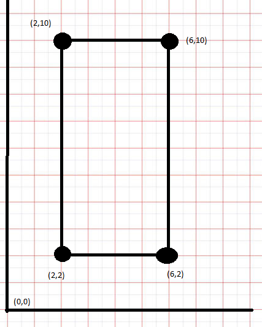
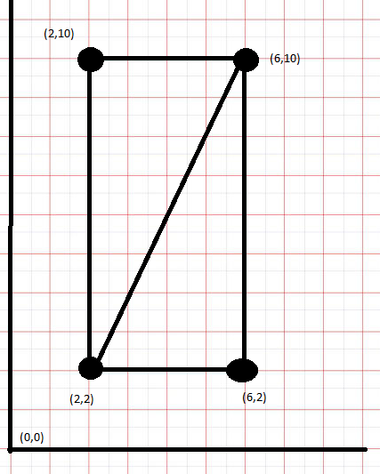
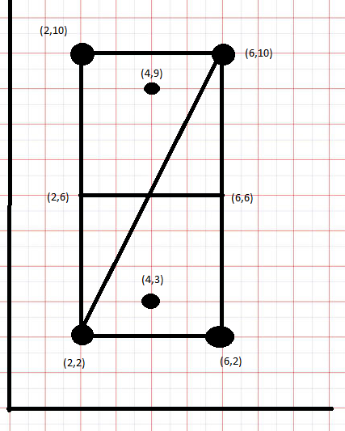
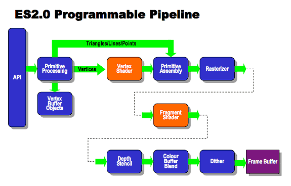

OpenGL: vértices y shaders
===========================

Introducción
------------------------------------------------------

En OpenGL todos los dibujos se componen a partir de dos elementos básicos:

* Vértices: son puntos del espacio.
* Shaders: son "pequeños programas" que dibujan polígonos uniendo vértices.

Aparte de eso, no solo nos interesará dibujar, sino también poder interactuar con la pantalla o conocer algunos conceptos sobre gráficos en OpenGL. En las secciones siguientes se profundizará en los detalles.

Ejes de coordenadas
--------------------

Si dibujamos un eje de coordenadas y dibujamos un rectángulo sabremos que cada vértice tendrá unas coordenadas.

   
   Un rectángulo cualquiera
   
   
Sin embargo OpenGL solo puede dibujar triángulos. Este problema se resuelve fácilmente dividiendo el rectángulo.

   
   Un rectángulo hecho triángulos

Cojamos la clase ``Renderer`` anterior y añadamos los vértices. Obsérvese que aún no nos movemos en 3D por lo que todo vértice tiene dos componentes.
   

.. code-block:: java

	public class MiRenderer implements Renderer {
		private int NUM_COMPONENTES=2;
		private float[] vertices={
				//Primer triangulo
				2f, 2f,
				6f,10f,
				2f,10f,
				//Segundo triangulo
				2f,2f,
				6f,2f,
				6f,10f
		};
		@Override
		public void onDrawFrame(GL10 arg0) {
			....
		}
	}

Obsérvese en qué orden ponemos los vértices. **Hemos dibujado los triángulos en sentido anti-horario.** Es muy útil dibujar siempre en el mismo orden, ya que más adelante se podrán hacer optimizaciones. Al orden en que se dibuja algo se le denomina "winding order".

Si ahora añadimos elementos como una línea divisoria o dos puntos para indicar las raquetas tendremos algo así:

   
   Esquema general
   
Y el código sería así:

.. code-block:: java

	public class MiRenderer implements Renderer {
		private int NUM_COMPONENTES=2;
		
		private float[] vertices={
				//Primer triangulo
				2f, 2f,
				6f,10f,
				2f,10f,
				//Segundo triangulo
				2f,2f,
				6f,2f,
				6f,10f,
				//Linea divisoria
				2f,6f,
				6f,6f,
				//Pomo de abajo
				4f,3f,
				//Pomo de arriba
				4f,9f
				
		};
		@Override
		public void onDrawFrame(GL10 arg0) {
			...
		}
	}
	
Enviando los datos a OpenGL
------------------------------------------------------

En este punto hay un problema, porque OpenGL no está escrito en Java. Sin embargo,podemos usar métodos JNI que existen en Android y que permite "enviar" datos al driver OpenGL. De hecho este vector sabemos que tiene 10 elementos y que en Java cada float tiene 32 bits o lo que es lo mismo, 4 bytes.

Para enviar un vector de floats a OpenGL se puede usar la clase ``FloatBuffer`` en la cual también indicaremos como se deben ordenar los bits (normalmente usaremos el orden nativo del dispositivo). En el código siguiente hemos creado un método que recibe un vector de floats Java y crea un ``FloatBuffer`` al estilo de lo que necesita OpenGL.

.. code-block:: java

	public class MiRenderer implements Renderer {
		private int NUM_COMPONENTES=2;
		private float[] vertices={
			...
		};
		private int BYTES_POR_FLOAT=4;
		private FloatBuffer datosVertices;
		@Override	
		public FloatBuffer crearBuffer(float[] datos){
			int totalBytes=datos.length*BYTES_POR_FLOAT;
			ByteBuffer temp=ByteBuffer.allocateDirect(totalBytes);
			ByteOrder orden=ByteOrder.nativeOrder();
			return temp.asFloatBuffer();
		}
		
		/* ..codigo omitido*/
		
		@Override
		public void onSurfaceCreated(GL10 arg0, EGLConfig arg1) {
			glClearColor(1.0f, 0.0f,0.0f,0.0f);
			datosVertices=crearBuffer(vertices);
		}	
	} //Fin de la clase

El flujo de OpenGL
------------------------------------------------------

Para dibujar algo, OpenGL ejecuta muchos procesos intermedios. Por ejemplo, primero se dibujan los vértices, luego se unen para crear polígonos, luego se rellenan polígonos, etc... En la figura siguiente se pueden ver las etapas

   
   Etapas de OpenGL
   
Así por ejemplo, para cada vértice **tenemos que ejecutar un pequeño programa que lo dibuje**. A este pequeño programa se le denomina un "vertex shader". Para cada polígono formado uniendo vértices se le tiene que asignar un color. De este "rellenado" se ocupan los programa llamados "fragment shaders".

Por desgracia estos programas tienen su propia sintaxis que no es como la de Java, por lo que habrá que aprender un nuevo lenguaje (llamado GLSL "GL Shading Language", aunque es muy parecido a C).

Por ejemplo, un fragment shader típico suele ser así:

.. code-block:: c

	attribute vec4 posicion;
	void main(){
		gl_Position=posicion;
	}
	
En la primera línea se define un *atributo* (``attribute``) llamado "posicion" que es del tipo `` vec4``. En OpenGL el tipo ``vec4`` es un vector de 4 posiciones, siendo las tres primeras las coordenadas *(x,y,z)* del punto. El último se usará más adelante.

El programa principal lo único que hacer es dibujar el punto (asignando nuestro "posicion" a la variable global "gl_Position"). Por así decirlo, para modificar la posición de un vértice hay que modificar su "gl_Position".

Este "miniprograma" tendrá que ejecutarse para cada vértice, sin embargo esto no será suficiente. Tendremos que construir los triángulos usando "fragment shaders" y colorear dichos triángulos.

Recordemos que a OpenGL le estamos pasando floats, que en Java tienen 32 bits, sin embargo en OpenGL podemos decidir no utilizar la misma precisión a fin de acelerar el programa (y utilizar por ejemplo menos de 32 bits para algo). En nuestro fragment shader indicaremos un color de rellenado pero en él no usaremos la máxima precisión para el color, sino algo un poco menor. Un ejemplo de fragment shader sería este:

.. code-block:: c

	precision medium_p float;
	uniform vec4 un_color;
	void main(){
		gl_FragColor=un_color;
	}
	
Nuestro programa es parecido al anterior con alguna pequeña diferencia:

* Hemos dicho que los "float" de Java usarán en este caso una precisión menor, la "medium_p" (existen "low_p", "medium_p" y "high_p" aunque este ultimo en pocos móviles, se usa más bien en PC)
* Nuestro "attribute" ahora es "uniform". Con ello estamos avisando que el color va a ser "uniforme" es decir que no va a cambiar. Esto permite a OpenGL ir aún más deprisa.
* Nuestro main se limita a poner el color al valor que tenga "un_color". Para cambiar algo de color hay que cambiar la variable globar "gl_FragColor".

OpenGL usa el modelo de colores RGB donde cada color puede ir de 0.0 (el mínimo) a 1.0 (el máximo). Como puede verse, por lo demás es parecido al modelo de colores HTML.