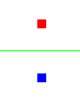

OpenGL: compilado
===========================

Introducción
------------------------------------------------------
En el apartado anterior hemos visto que es necesario crear "programas separados" para poder acceder a la aceleración gráfica. En este capítulo veremos como compilar y enlazar estos programas para poder visualizar el resultado en pantalla. También veremos como OpenGL muestra los elementos en pantalla y como necesitaremos adaptarnos a su sistema de coordenadas.

En este capítulo crearemos una clase auxiliar llamada ``OpenGLHelper.java`` que podremos reutilizar el resto del tema.

Cargando shaders
------------------------------------------------------
En primer lugar necesitamos que nuestra clase ``OpenGLHelper.java`` disponga de un método que permita cargar recursos (en este caso nuestros mini-programas OpenGL) y dejarlos en un ``String``

El programa siguiente abre un fichero de recurso que habremos guardado en ``res/raw``

.. code-block:: java

	public class OpenGLHelper {
		public static String cargarFicheroPrograma(
					Context contexto, int idRecurso)
		{
			StringBuilder programa=
					new StringBuilder();
			try{
				Resources res=contexto.getResources();
				InputStream is=
						res.openRawResource(idRecurso);
				InputStreamReader isr=
						new InputStreamReader(is);
				BufferedReader bfr=
						new BufferedReader(isr);
				String linea;
				linea=bfr.readLine();
				while (linea!=null){
					programa.append(linea+"\n");
					linea=bfr.readLine();
				} //Fin del while
			} //Fin del try
			catch (IOException e){
				throw new RuntimeException(
					"No se pudo abrir el recurso "+
					"cuyo id era:"+idRecurso);
			} //Fin del catch IOException
			catch (Resources.NotFoundException nfe){
				throw new RuntimeException(
						"No se encontro el recurso "+
						"cuyo id era:"+idRecurso);
			}
			return programa.toString();
		} //Fin de cargarFicheroPrograma
	}

Ahora la clase ``MiRenderer.java`` necesita un constructor como este:

.. code-block:: java

	public MiRenderer(Context ctx){
		this.contexto=ctx;
		String vertexShader=
				OpenGLHelper.cargarFicheroPrograma(
						contexto, R.raw.vertices);
		String fragmentShader=
				OpenGLHelper.cargarFicheroPrograma(
						contexto, R.raw.fragments);
	}
	
Compilando shaders
------------------------------------------------------

Ahora que podemos cargar ficheros necesitamos compilarlos. Para ello añadiremos a la clase ``OpenGLHelper`` el código siguiente:

.. code-block:: java
	public static int compilarVertexShader 
			(String codigo)
	{
			int idPrograma;
			idPrograma=compilar(
					GL_VERTEX_SHADER,codigo);
			return idPrograma;
	} //Fin de compilarVertexShader		
	public static int compilarFragmentShader
			(String codigo)
		{
			int idPrograma;
			idPrograma=compilar(
					GL_FRAGMENT_SHADER,codigo);
			return idPrograma;
	} //Fin de compilarFragmentShader
	public static int compilar
			(int tipo, String codigo)
		{
			int idShader;
			//Se pide a OpenGL que nos cree
			//un id de shader vacío
			idShader=glCreateShader(tipo);
			//Si es 0, es que hubo un error
			if (idShader==0){
				if (LOGS_ACTIVADOS){
					Log.d("DEBUG","Fallo al crear shader");
				}
				return 0;
			}
			//Y si no hay error cargamos el codigo
			glShaderSource(idShader, codigo);
			//Lo compilamos
			glCompileShader(idShader);
			//Comprobamos si hay error al compilar
			int[] error=new int[1];
			/* Se consulta el estado de GL_COMPILE_STATUS
			 * y se pide que se guarde el estado en el
			 * vector error en la posicion 0*/
			glGetShaderiv(idShader, 
					GL_COMPILE_STATUS, 
					error, 0);
			if (error[0]==0){
				if (LOGS_ACTIVADOS){
					Log.d("DEBUG", 
						"Error al compilar, codigo:"+error[0]);
					Log.d("DEBUG", "Codigo:\n"+codigo);
					String msg=glGetShaderInfoLog(idShader);
					Log.d("DEBUG", "Mensaje:"+msg);
				}
			}
			/* Si no ha habido error todo fue bien
			 * y tenemos un id de programa con
			 * codigo compilado correctamente
			 */
			return idShader;
		} //Fin de compilar

Obsérvese que hemos añadido dos métodos auxiliares ``compilarVertexShader`` y ``compilarFragmentShader`` que en realidad llaman al método ``compilar``. Dicho método es el corazón del proceso de compilación.

Como se ve, el proceso de compilación es más o menos el siguiente:

1. Crear un shader vacío.	
2. Se inyecta en ese shader vacío el código del shader cargado con ``glShaderSource``.
3. Se compila dicho shader con ``glCompileSource``
4. Se comprueba si hay errores con ``glGetShaderiv``.

Enlazando shaders
------------------------------------------------------

Un programa OpenGL consta de un shader para los vértices más un shader para los fragmentos. Es necesario "unir" los dos programas mediante un proceso de enlace como el que realiza el método siguiente:

.. code-block:: java

	public static int enlazar
	(int idVertexShader, int idFragmentShader)
	{
		int idPrograma=glCreateProgram();
		if (idPrograma==0){
			if (LOGS_ACTIVADOS){
				Log.d("DEBUG", "No se pudo crear un programa OpenGL");
				return 0;
			}		
		}
		/* Si se pudo crear un programa vacío se intentan enlazar
		 * el vertexshader y el fragmentshader */
		glAttachShader(idPrograma, idVertexShader);
		glAttachShader(idPrograma, idFragmentShader);
		/* Se intenta hacer el enlazado*/
		glLinkProgram(idPrograma);
		/* Y se comprueba si hay errores*/
		int[] codigoError=new int[1];
		glGetProgramiv(idPrograma, GL_LINK_STATUS, codigoError, 0);
		if (codigoError[0]==0){
			if (LOGS_ACTIVADOS){
				Log.d("DEBUG", "Error al enlazar");
				String msg=glGetProgramInfoLog(idPrograma);
				Log.d("DEBUG", "Mensaje:"+msg);
				return 0;
			}
		}
		/* Si no hay errores, perfecto*/
		return idPrograma;
	}	

El proceso es el siguiente:

1. Se crea un programa vacío.
2. Se meten dentro de él los dos shader (el de vértices y el de fragmentos)
3. Se hace el enlazado.
4. Se comprueba si hubo errores.

Validación de un programa
------------------------------------------------------

Todo programa OpenGL debe validarse. El código siguiente ilustra como realizar esta tarea.

.. code-block:: java

	public static boolean validarPrograma(
		int idPrograma)
	{
		/* Se intenta validar*/
		glValidateProgram(idPrograma);
		/* Y se comprueba si hay algun error*/
		int[] codigoError=new int[1];
		glGetProgramiv(idPrograma, GL_VALIDATE_STATUS, codigoError, 0);
		if (codigoError[0]==0){
			if (LOGS_ACTIVADOS){
				Log.d("DEBUG", "Error al enlazar");
				String msg=glGetProgramInfoLog(idPrograma);
				Log.d("DEBUG", "Mensaje:"+msg);
				return false;
			}
		}
		/* Si se llega aquí no hay error y el programa es válido 
		 * para el estado actual de OpenGL	 */
		return true;		
	} /*Fin de validar*/
	
Conexiones finales
------------------------------------------------------
Nuestros fragments hacían referencia a valores tales como la posición o el color. Sin embargo aún no se ha conectado ninguno de los fragment con ninguna variable Java. 

Esta conexión la haremos en nuestro renderer, por lo que añadiremos el siguiente código a nuestro archivo ``MiRenderer.java``

.. code-block:: java

	/* Color "uniform" de los fragment en el fichero glsl*/
	private String nombreColorFragment="un_color";
	private int direccionColorFragment;
	/* Posicion (attribute) de los vertices en el fichero glsl*/
	private String nombreAtrPosicion="posicion";
	private int direccionPosicionFragment;
	
El proceso que haremos será pedir a OpenGL la dirección de memoria donde ha decidido almacenar dichos valores. Luego escribiremos valores en estas direcciones de memoria para conseguir "pasar" valores a OpenGL.Estas conexiones las haremos en el método ``onSurfaceCreated``.

Además, tenemos que indicar a OpenGL donde encontrar datos para dibujar los vértices que hemos definido. Al final de ``onSurfaceCreated`` indicaremos lo siguiente:

.. code-block:: java

		/* Nos aseguramos de que los datos se empiecen a leer desde la posición 0 */
		datosVertices.position(0);
		/* 
		 * 1. Enviar cada posicion a direccionPosicionFragment
		 * 2. Cada vertice tiene NUM_COMPONENTES (dos, la x y la y)
		 * 3. Leer valores float (GL_FLOAT)
		 * 4. No hay que "normalizar" datos (false)
		 * 5. El 0 es la posicion del atributo en un vector, como solo
		 * hay un atributo indicamos la primera posicion
		 * 6. Leer los datos de datosVertices 
		 */
		glVertexAttribPointer(direccionPosicionFragment,
				this.NUM_COMPONENTES, GL_FLOAT,false,0,datosVertices);
		/* Habilitar los datos*/
		glEnableVertexAttribArray(direccionPosicionFragment);

Lo que este código hace es ejecutar el vertex shader para cada elemento de nuestro vector ``datosVertices``. OpenGL irá tomando cada valor, lo meterá en cierta dirección de memoria (que hemos llamado ``direccionPosicionFragment``. OpenGL tendrá en cuenta que debe leer ``floats`` y que deberá hacerlo de dos en dos.
		
Dibujando
------------------------------------------------------

Ahora podemos indicar como se dibujan los elementos en el método ``onDrawFrame``:

.. code-block:: java

	
	public void onDrawFrame(GL10 arg0) {
		glClear(GL_COLOR_BUFFER_BIT);
		/* Indicamos que la tabla es de color blanco*/
		glUniform4f(this.direccionColorFragment, 1.0f, 1.0f, 1.0f, 1.0f);
		/* Y dibujamos los 6 primeros elementos del vector*/
		glDrawArrays(GL_TRIANGLES, 0, 6);
	}
	
Sin embargo *no se dibuja nada*. Esto se debe a que en OpenGL el origen de coordenadas está en el centro de la pantalla (0,0) y la coordenada más alta que se puede poner es (1,1) para la esquina superior derecha y (-1, -1) para la esquina inferior izquierda. Es decir, lo que dibujamos queda más allá de nuestra vista. Sin embargo, si corregimos el vector y lo dejamos así...:
 
.. code-block:: java
	
	private float[] vertices={
			//Primer triangulo
			-0.5f, -0.5f,
			0.5f, 0.5f,
			-0.5f, 0.5f,
			//Segundo triangulo
			-0.5f, -0.5f, 
			0.5f, -0.5f, 
			0.5f, 0.5f, 
			//Linea divisoria
			-0.5f, 0f,
			0.5f, 0f,
			//Pomo de abajo
			0f, -0.25f,
			//Pomo de arriba
			0f, 0.25f
			
	};
	
... el problema se arreglará.

Por otra parte aún tenemos que dibujar la línea de separación más los dos mandos de los jugadores. Lo único que tenemos que hacer es indicar los colores solicitar a OpenGL que siga dibujando cosas tomando elementos del vector que hicimos.

* Usaremos la constante ``GL_TRIANGLES`` para dibujar triángulo.
* ``GL_LINES`` para pedir a OpenGL que dibuje líneas.
* ``GL_POINTS`` para dibujar puntos.

.. code-block:: java

	public void onDrawFrame(GL10 arg0) {
		glClear(GL_COLOR_BUFFER_BIT);
		/* Indicamos que la tabla es de color blanco*/
		glUniform4f(this.direccionColorFragment, 1.0f, 1.0f, 1.0f, 1.0f);
		/* Y dibujamos los 6 primeros elementos del vector*/
		glDrawArrays(GL_TRIANGLES, 0, 6);
		//Dibujamos la linea de separacion en verde
		glUniform4f(this.direccionColorFragment, 0.0f, 1.0f, 0.0f, 0.0f);
		glDrawArrays(GL_LINES, 6,2);
		//Dibujamos un mando de color azul
		glUniform4f(this.direccionColorFragment, 0.0f, 0.0f, 1.0f, 0.0f);
		glDrawArrays(GL_POINTS, 8,1);
		//Y uno rojo
		glUniform4f(this.direccionColorFragment, 1.0f, 0.0f, 0.0f, 0.0f);
		glDrawArrays(GL_POINTS, 9,1);
	}
Resultado final
----------------------------

El resultado final será el siguiente

   
   Nuestro primer dibujo OpenGL
   
El código de la clase ``MiRenderer`` es el siguiente:

.. code-block:: java

	
	import static android.opengl.GLES20.GL_TRIANGLES;
	import ....
	public class MiRenderer implements Renderer {
		private int NUM_COMPONENTES=2;
		private boolean LOG_ACTIVADO=true;
		private float[] vertices={
				//Primer triangulo
				-0.5f, -0.5f,
				0.5f, 0.5f,
				-0.5f, 0.5f,
				//Segundo triangulo
				-0.5f, -0.5f, 
				0.5f, -0.5f, 
				0.5f, 0.5f, 
				//Linea divisoria
				-0.5f, 0f,
				0.5f, 0f,
				//Pomo de abajo
				0f, -0.25f,
				//Pomo de arriba
				0f, 0.25f
		};
		Context contexto;
		private int BYTES_POR_FLOAT=4;
		private FloatBuffer datosVertices;
		/* Color "uniform" de los fragment en el fichero glsl*/
		private String nombreUniformColorDelFragment="un_color";
		private int direccionColorFragment;
		/* Posicion (attribute) de los vertices en el fichero glsl*/
		private String nombreAtrPosicion="posicion";
		private int direccionPosicionFragment;
		private int idProgramaOpenGL=0;
		public MiRenderer(Context ctx){
			this.contexto=ctx;
			datosVertices=crearBuffer(vertices);
			datosVertices.put(vertices);
		}
		@Override
		public void onSurfaceCreated(GL10 arg0, EGLConfig arg1) {
			glClearColor(0.0f, 0.0f, 0.0f, 0.0f);
			compilarShaders();
			Log.d("DEBUG", "Compilados!");
			/* Averiguamos la direccion donde se almacena
			 * el color de cada fragmento */
			direccionColorFragment=
			glGetUniformLocation(
					idProgramaOpenGL,
					nombreUniformColorDelFragment);
			this.direccionPosicionFragment=
			glGetAttribLocation(
					idProgramaOpenGL,
					this.nombreAtrPosicion);
			/* Nos aseguramos de que los datos se empiecen a leer
			 * desde la posición 0 */
			datosVertices.position(0);
			/* 
			 * 1. Enviar cada posicion a direccionPosicionFragment
			 * 2. Cada vertice tiene NUM_COMPONENTES (dos, la x y la y)
			 * 3. Leer valores float (GL_FLOAT)
			 * 4. No hay que "normalizar" datos (false)
			 * 5. El 0 es la posicion del atributo en un vector, como solo
			 * hay un atributo indicamos la primera posicion
			 * 6. Leer los datos de datosVertices 
			 */
			glVertexAttribPointer(
			direccionPosicionFragment,
			this.NUM_COMPONENTES,
			GL_FLOAT,false,
			0,datosVertices);
			/* Habilitar los datos*/
			glEnableVertexAttribArray(
			direccionPosicionFragment);
		} //Fin de onSurfaceCreated
		@Override
		public void onDrawFrame(GL10 arg0) {
			glClear(GL_COLOR_BUFFER_BIT);
			/* Indicamos que la tabla es de color blanco*/
			glUniform4f(this.direccionColorFragment,
			1.0f, 1.0f, 1.0f, 1.0f);
			/* Y dibujamos los 6 primeros elementos del vector*/
			glDrawArrays(GL_TRIANGLES, 0, 6);
			//Dibujamos la linea de separacion en verde
			glUniform4f(this.direccionColorFragment,
			0.0f, 1.0f, 0.0f, 0.0f);
			glDrawArrays(GL_LINES, 6,2);
			//Dibujamos un mando de color azul
			glUniform4f(this.direccionColorFragment,
			0.0f, 0.0f, 1.0f, 0.0f);
			glDrawArrays(GL_POINTS, 8,1);
			//Y uno rojo
			glUniform4f(this.direccionColorFragment,
			1.0f, 0.0f, 0.0f, 0.0f);
			glDrawArrays(GL_POINTS, 9,1);
		}
		@Override
		public void onSurfaceChanged(GL10 arg0, int width, int height) {
			glViewport(0,0,width,height);	
		}
		public FloatBuffer crearBuffer(float[] datos){
			int totalBytes=datos.length*BYTES_POR_FLOAT;
			ByteBuffer temp=ByteBuffer.allocateDirect(totalBytes);
			ByteOrder orden=ByteOrder.nativeOrder();
			temp.order(orden);
			return temp.asFloatBuffer();
		}
		private void compilarShaders(){
			String vertexShader=
					OpenGLHelper.cargarFicheroPrograma(
							contexto, R.raw.vertices);
			int idProgramaVertex=
					OpenGLHelper.compilarVertexShader(
							vertexShader);
			String fragmentShader=
					OpenGLHelper.cargarFicheroPrograma(
							contexto, R.raw.fragments);
			int idProgramaFragment=
					OpenGLHelper.compilarFragmentShader(
							fragmentShader);
			int idPrograma=OpenGLHelper.enlazar(
					idProgramaVertex, idProgramaFragment);
			boolean esProgramaValido=OpenGLHelper.validarPrograma(
					idPrograma);
			if (esProgramaValido){
				glUseProgram(idPrograma);
				this.idProgramaOpenGL=idPrograma;
			} else {
				Log.d("DEBUG", "No se pudo validar el programa");
			} //Fin del if
		} //Fin de compilarShaders
	} //Fin de la clase
	
El código de la clase ``OpenGLHelper`` quedará así:

.. code-block:: java

	public class OpenGLHelper {
		private static boolean LOGS_ACTIVADOS=true;
		public static String cargarFicheroPrograma(
					Context contexto, int idRecurso)
		{
			StringBuilder programa=
					new StringBuilder();
			try{
				Resources res=contexto.getResources();
				InputStream is=
						res.openRawResource(idRecurso);
				InputStreamReader isr=
						new InputStreamReader(is);
				BufferedReader bfr=
						new BufferedReader(isr);
				String linea;
				linea=bfr.readLine();
				while (linea!=null){
					programa.append(linea+"\n");
					linea=bfr.readLine();
				} //Fin del while
			} //Fin del try
			catch (IOException e){
				throw new RuntimeException(
					"No se pudo abrir el recurso "+
					"cuyo id era:"+idRecurso);
			} //Fin del catch IOException
			catch (Resources.NotFoundException nfe){
				throw new RuntimeException(
						"No se encontro el recurso "+
						"cuyo id era:"+idRecurso);
			}
			return programa.toString();
		} //Fin de cargarFicheroPrograma
		public static int compilarVertexShader 
			(String codigo)
		{
			int idPrograma;
			idPrograma=compilar(
					GL_VERTEX_SHADER,codigo);
			return idPrograma;
		} //Fin de compilarVertexShader
		
		public static int compilarFragmentShader
			(String codigo)
		{
			int idPrograma;
			idPrograma=compilar(
					GL_FRAGMENT_SHADER,codigo);
			return idPrograma;
		} //Fin de compilarFragmentShader
		public static int compilar
			(int tipo, String codigo)
		{
			int idShader;
			//Se pide a OpenGL que nos cree
			//un id de shader vacío
			idShader=glCreateShader(tipo);
			//Si es 0, es que hubo un error
			if (idShader==0){
				if (LOGS_ACTIVADOS){
					Log.d("DEBUG","Fallo al crear shader");
				}
				return 0;
			}
			//Y si no hay error cargamos el codigo
			glShaderSource(idShader, codigo);
			//Lo compilamos
			glCompileShader(idShader);
			//Comprobamos si hay error al compilar
			int[] error=new int[1];
			/* Se consulta el estado de GL_COMPILE_STATUS
			 * y se pide que se guarde el estado en el
			 * vector error en la posicion 0*/
			glGetShaderiv(idShader, 
					GL_COMPILE_STATUS, 
					error, 0);
			if (error[0]==0){
				if (LOGS_ACTIVADOS){
					Log.d("DEBUG", 
						"Error al compilar, codigo:"+error[0]);
					Log.d("DEBUG", "Codigo:\n"+codigo);
					String msg=glGetShaderInfoLog(idShader);
					Log.d("DEBUG", "Mensaje:"+msg);
				}
			}
			/* Si no ha habido error todo fue bien
			 * y tenemos un id de programa con
			 * codigo compilado correctamente
			 */
			return idShader;
		} //Fin de compilar
		
		public static int enlazar(int idVertexShader, int idFragmentShader){
			int idPrograma=glCreateProgram();
			if (idPrograma==0){
				if (LOGS_ACTIVADOS){
					Log.d("DEBUG", 
					"No se pudo crear un 
					programa OpenGL");
					return 0;
				}		
			}
			/* Si se pudo crear un programa vacío se intentan enlazar
			 * el vertexshader y el fragmentshader */
			glAttachShader(idPrograma, idVertexShader);
			glAttachShader(idPrograma, idFragmentShader);
			/* Se intenta hacer el enlazado*/
			glLinkProgram(idPrograma);
			/* Y se comprueba si hay errores*/
			int[] codigoError=new int[1];
			glGetProgramiv(idPrograma, GL_LINK_STATUS, codigoError, 0);
			if (codigoError[0]==0){
				if (LOGS_ACTIVADOS){
					Log.d("DEBUG", "Error al
					enlazar");
					String msg=
						glGetProgramInfoLog(idPrograma);
					Log.d("DEBUG", "Mensaje:"+msg);
					return 0;
				}
			}
			/* Si no hay errores, perfecto*/
			return idPrograma;
		}
		public static boolean validarPrograma(int idPrograma){
			/* Se intenta validar*/
			glValidateProgram(idPrograma);
			/* Y se comprueba si hay algun error*/
			int[] codigoError=new int[1];
			glGetProgramiv(idPrograma, GL_VALIDATE_STATUS, codigoError, 0);
			if (codigoError[0]==0){
				if (LOGS_ACTIVADOS){
					Log.d("DEBUG", "Error al enlazar");
					String msg=glGetProgramInfoLog(idPrograma);
					Log.d("DEBUG", "Mensaje:"+msg);
					return false;
				}
			}
			/* Si se llega aquí no hay error y el programa es válido 
			 * para el estado actual de OpenGL	 */
			return true;		
		} /*Fin de validar*/
	}
	
	
   
