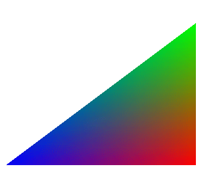
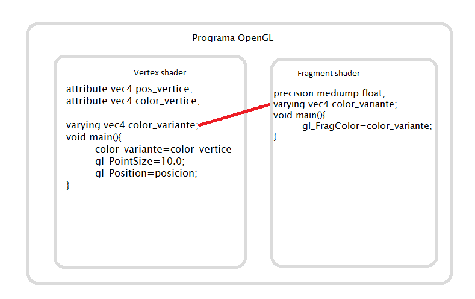
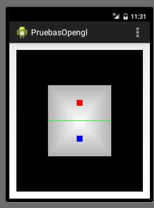

OpenGL: sombreado
===========================

Introducción
------------------------------------------------------

Hasta ahora hemos usado colores "planos", sin embargo en la vida real toda superficie tiene distintas tonalidades, gradientes de color y/o sombras. En OpenGL se puede conseguir automáticamente el degradado progresivo de color en superficies de una forma bastante cómoda.

Suavizado de colores
--------------------

El proceso en realidad es bastante sencillo: dados tres vértices de un triángulo podemos asociar un color a cada vértice y OpenGL realizará el degradado automáticamente.

La clave principal está en los atributos ``varying``. Un ``varying`` proporciona una conexión entre un vertex shader y un fragment shader. Cuando se define un ``varying`` en un vertex shader OpenGL lo modifica y lo pasa al fragment shader. Por ejemplo, supongamos que creamos un triángulo con tres vértices de color rojo, verde y azul. Utilizando un ``varying`` OpenGL creará automáticamente los valores intermedios para crear el degradado de colores que se ve a continuación:

   
   Degradado con OpenGL y varying's
   

Nuestro programa OpenGL tendrá esta estructura, obsérverse que hemos modificado algunos nombres de variable:

   
   Estructura de un programa OpenGL con varying.
   
Como se ve antes un fragmento tenía un color que asignábamos nosotros. Ahora el color lo tendrá el punto, sin embargo copiaremos dicho color en un ``varying`` y dicho color estará disponible para el fragent shader.

A continuación el vertex shader:

.. code-block:: c

	attribute vec4 posicion;
	attribute vec4 color_vertice;

	varying vec4 color_variante;
	void main(){
		color_variante=color_vertice;
		gl_PointSize=10.0;
		gl_Position=posicion;
	}

Obsérvese que como que como ``color_variante`` es un ``varying`` que luego OpenGL pasará al fragment shader, en cada vértice nos tenemos que apuntar el color de dicho vértice.

A continuación el fragment shader:

.. code-block:: c

	precision mediump float;
	varying vec4 color_variante;
	void main(){
		gl_FragColor=color_variante;
	}	
	

	
Modifiquemos los vértices y añadamos a cada punto tres componentes RGB:

.. code-block:: java

	/* Ahora todos los vértices tienen un color*/
	private float[] grupoTriangulos={
			//Vértice central de color blanco
			0, 		0,	 	1, 1, 1,
			//Resto de vértices, ligeramente grises
			-0.5f,	-0.5f, 	0.7f, 0.7f, 0.7f, 
			 0.5f,	-0.5f, 	0.7f, 0.7f, 0.7f, 
			 0.5f,	 0.5f, 	0.7f, 0.7f, 0.7f, 
			-0.5f,	 0.5f, 	0.7f, 0.7f, 0.7f, 
			-0.5f,	-0.5f, 	0.7f, 0.7f, 0.7f, 
			//Linea divisoria, de color verde
			-0.5f,	  0f, 	0f, 1f, 0f, 
			 0.5f, 	  0f, 	0f, 1f, 0f, 
			//Pomo de abajo, azul
			0f, 	-0.25f, 0f, 0f, 1f, 
			//Pomo de arriba, rojo
			0f, 	 0.25f, 1f, 0f, 0f, 
	};

Ahora, al leer cada vértice tenemos que leer 2 componentes (x,y) y luego saltar 3 (rojo, verde, azul), leer 2 y saltar 3, y así sucesivamente. Necesitaremos algunas constantes más.

.. code-block:: java

	private int NUM_COMPONENTES_PUNTO=2;
	private int NUM_COMPONENTES_COLOR=3;
	private int BYTES_POR_FLOAT=4;
	private int STRIDE = (
			NUM_COMPONENTES_PUNTO + NUM_COMPONENTES_COLOR
			) * BYTES_POR_FLOAT;
			

Ahora tendremos que modificar el ``onSurfaceCreated`` para que ADEMAS de leer todos los datos de vértices, también lea los colores de los vértices. Esto implica que habrá que crear que indicar otra dirección para ir comunicando a OpenGL los colores de cada vértice.

El código de la clase queda así:

.. code-block:: java

	public void onSurfaceCreated(GL10 arg0, EGLConfig arg1) {
		glClearColor(0.0f, 0.0f, 0.0f, 0.0f);
		compilarShaders();
		
		direccionColorVertice=glGetAttribLocation(
				idProgramaOpenGL,nombreAtrColorVertice);
		this.direccionPosicionVertice=glGetAttribLocation(
				idProgramaOpenGL,this.nombreAtrPosVertice);
		
		datosVertices.position(0);
		glVertexAttribPointer(direccionPosicionVertice,
				this.NUM_COMPONENTES_PUNTO, GL_FLOAT,false,STRIDE,datosVertices);
		/* Habilitar los datos*/
		glEnableVertexAttribArray(direccionPosicionVertice);
		
		/* Aquí en lugar de las posiciones, se van leyendo los colores
		 * por lo que hay que empezar a leer en otra posicion
		 */
		datosVertices.position(NUM_COMPONENTES_PUNTO);
		glVertexAttribPointer(direccionColorVertice,this.NUM_COMPONENTES_COLOR,
				GL_FLOAT, false, STRIDE, datosVertices);
		/* Y se habilita la lectura de colores*/
		glEnableVertexAttribArray(direccionColorVertice);
	} //Fin de onSurfaceCreated
	@Override
	public void onDrawFrame(GL10 arg0) {
		glClear(GL_COLOR_BUFFER_BIT);
		/* Mesa*/
		glDrawArrays(GL_TRIANGLE_FAN, 0,6);
		/* Linea divisoria*/
		glDrawArrays(GL_LINES, 6,2);
		/* Pomos*/
		glDrawArrays(GL_POINTS, 8,1);
		glDrawArrays(GL_POINTS, 9,1);
	}

El resultado que se obtendrá se muestra a continuación:

   
   Suavizado de colores.
   
