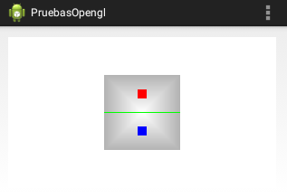

OpenGL: perspectiva
===================

Introducción
------------------------------------------------------
Hasta ahora hemos ejecutado el juego en la posición habitual del móvil (vertical). Si se ejecuta el juego en perspectiva horizontal (puede usar ``Ctrl+F11`` en el simulador) se observará lo siguiente:

.. figure:: /imagenes/opengl/juegohorizontal.png
   :figwidth: 50%
   :align: center
   
   Juego en perspectiva horizontal
   
Como puede apreciarse aunque nuestra mesa está definida como un cuadrado **lo que en realidad se ve es un rectángulo**. Esto se debe a que en OpenGL se definen distintos sistemas de coordenadas y hasta ahora hemos trabajando directamente con las coordenadas del dispositivo, llamadas también "coordenadas normalizadas de dispositivo".

La proporcionalidad
------------------------------------------------------

Supongamos un dispositivo Android con una resolución de 1280x720 puntos. Está claro que aunque dibujemos en el rango [-1, 1] las coordenadas reales de Android estarán en el rango  [0,1280] para un eje y [0,720] para el otro, lo cual nos da una pantalla en la que las medidas **no son proporcionales**.

Lo que necesitamos es disponer de un sistema de coordenadas tal que si por ejemplo el rango [0,720] lo comprimimos a [-1, 1] el rango [0,1280] habría que comprimirlo a [-(1280/720), (1280/720)]. Es decir, necesitamos disponer de un sistema de "coordenadas virtuales".

Para pasar de nuestro sistema de "coordenadas virtuales" a "coordenadas de dispositivo" hay que hacer un proceso llamado "proyección", en concreto queremos una "proyección ortográfica", en la que todos los objetos se muestran de igual tamaño,sin importarnos su distancia.

Conceptos básicos de algebra
------------------------------------------------------

* Un vector es un conjunto de elementos. Un vector puede por ejemplo, representar las coordenadas x,y,z,w de un punto. Por ahora no usaremos w, dejaremos un valor por defecto de -1::

	| x |
	| y |
	| z |
	| w |

* Una matriz es un vector de dos dimensiones::

	| x1 x2 x3 x4 |
	| y1 y2 y3 y4 |
	| z1 z2 z3 z4 |
	| w1 w2 w3 w3 |
	
* Una matriz se puede multiplicar por un vector haciendo esta operación (obsérvese que al multiplicar una matriz por un vector el resultado es un vector::

	| x1 x2 x3 x4 |			| x |   | x1x + x2y + x3z + x4w |
	| y1 y2 y3 y4 |		*	| y | = | y1x + y2y + y3z + y4w |
	| z1 z2 z3 z4 |			| z |	| z1x + z2y + z3z + z4w |
	| w1 w2 w3 w3 |			| w |	| w1x + w2y + w3z + w4w |
	
* Existe una matriz especial llamada *matriz identidad*. Al multiplicarla por un vector se obtiene el mismo vector (es decir como multiplicar un número por uno)::

	| 1 0 0 0 |
	| 0 1 0 0 |
	| 0 0 1 0 |
	| 0 0 0 1 |
	
* Un vector se puede "trasladar" a otra posición utilizando una matriz. Es decir, supongamos que tenemos un punto en unas coordenadas "ficticias" (2,3,4) que queremos resituar en un nuevo sistema de coordenadas. Si por ejemplo queremos mover el punto 2 posiciones a la derecha, 3 hacia abajo (y negativa) sin cambiar la z usaremos una matriz identidad en la que ponemos la cantidad de movimiento así::

	| 1 0 0 diferencia de x |
	| 0 1 0 diferencia de y |
	| 0 0 1 diferencia de z |
	| 0 0 0       1         |
	
Es decir, nuestra "matriz de traslación" tendrá una diferencia de x de 2 y una diferencia de y de -3, porque ``y`` va hacia abajo::

	| 1 0 0  2 |
	| 0 1 0 -3 |
	| 0 0 1  0 |
	| 0 0 0  1 |
	
Si ahora multiplicamos nuestra matriz de traslación por nuestro punto original podremos ver si ha habido una traslación de verdad::

	| 1 0 0  2 |   | 2 |   | (1*2) + (0*3) + (0*4) + (2*1) |   | 4 |
	| 0 1 0 -3 | * | 3 | = | (0*2) + (1*3) + (0*4) + (-3*1)| = | 0 |
	| 0 0 1  0 |   | 4 |   | (0*2) + (0*3) + (1*4) + (0*-1)|   | 4 |
	| 0 0 0  1 |   | 1 |   | (0*2) + (0*3) + (0*4) + (1*1) |   | 1 |
	
Es decir, el punto (2,3,4) ha pasado a ser el (4,0,4), es decir, se ha movido dos posiciones a la derecha y tres hacia abajo, como queríamos.

Definiendo una proyección ortográfica
------------------------------------------------------

Usando una matriz especial podemos crear un nuevo sistema de coordenadas que realmente esté entre [-1,1] para un eje y de [-1.78, 1.78] para el otro. En concreto se puede utilizar un método de la clase ``Matrix`` llamado ``orthoM``. El método acepta estos parámetros

* Un vector en el que se escribirá el punto resultado
* Un offset que permite empezar a escribir en el vector en una posición distinta de 0 (aunque normalmente usaremos 0)
* Dos float que indican el valor mínimo y máximo del eje X.
* Dos float que indican el valor mínimo y máximo del eje Y.
* Dos float que indican el valor mínimo y máximo del eje Z.

Una cuestión importante es que en general el eje X crece hacia la derecha y el Y hacia arriba, pero ¿hacia donde crece el eje Z? Hay dos reglas, la de la mano derecha y la de la mano izquierda. En general podemos usar las dos manos poniendo siempre el pulgar apuntando a X+ y el índice hacia Y+

* Si usamos la mano derecha y estiramos el dedo central, veremos que la Z+ apunta hacia nosotros.
* Si usamos la mano izquierda y estiramos el dedo central, la Z+ se aleja de nosotros.

Por desgracia ha habido distintos estándares aunque hoy en día se usa el de la mano izquierda, pero podría haber problemas en versiones anteriores de OpenGL.

Añadiendo la proyección ortográfica
------------------------------------------------------

En primer lugar hay que actualizar el vertex shader:

.. code-block:: c

	attribute vec4 pos_vertice;
	attribute vec4 color_vertice;
	uniform mat4 matriz_proyeccion;
	varying vec4 color_variante;
	void main(){
		color_variante=color_vertice;
		gl_PointSize=10.0;
		gl_Position=matriz_proyeccion*pos_vertice;
	}
	
Ahora necesitamos un método que nos genere la matriz correcta. Antes de generarla necesitamos saber si es mayor la anchura o la altura, para que la dimensión menor esté en [-1,1] y la mayor en [-1.78, 1.78], por ejemplo. Este método nos ayudará:

.. code-block:: java

	private final float[] getProyeccion(float anchura, float altura){
		float[] matriz=new float[16];
		float proporcion;
		if (anchura>altura){
			/* En este caso la altura irá entre -1 y 1
			 * y la anchura usará un rango mayor proporcionalmente */
			proporcion=anchura/altura;
			Matrix.orthoM(
				matriz, 0, -proporcion, proporcion,-1, 1, -1, 1);
			return matriz;
		}
		/* En caso contrario, la anchura va de -1 a 1 y 
		 * la altura en un rango -proporcion,+proporcion */
		proporcion=altura/anchura;
		Matrix.orthoM(
			matriz, 0, -1, 1, -proporcion, proporcion, -1, 1);
		return matriz;
	}	
	
Aparte de eso tenemos que modificar el ``onSurfaceCreated`` para poder leer el nuevo ``uniform`` que hay en el vertex shader y pasarle el valor creado.

.. code-block:: java

	public void onSurfaceCreated(GL10 arg0, EGLConfig arg1) {
		/*... codigo omitido*/
		direccionMatrizProyeccion=
				glGetUniformLocation(
						idProgramaOpenGL, 
						nombreUniMatrizProyeccion);
		
	} //Fin de onSurfaceCreated
	
Se modifica el ``onSurfaceChanged`` para que se recalcule la matriz:

.. code-block:: java

	public void onSurfaceChanged(GL10 arg0, int width, int height) {
		glViewport(0,0,width,height);
		matrizProyeccion=getProyeccion(width, height);
	}
	
Y se modifica el dibujado para que pase la matriz:

.. code-block:: java

	public void onDrawFrame(GL10 arg0) {
		glClear(GL_COLOR_BUFFER_BIT);
		/* Mesa*/
		glDrawArrays(GL_TRIANGLE_FAN, 0,6);
		/* Linea divisoria*/
		glDrawArrays(GL_LINES, 6,2);
		/* Pomos*/
		glDrawArrays(GL_POINTS, 8,1);
		glDrawArrays(GL_POINTS, 9,1);
		glUniformMatrix4fv(
				/*direccion a la que enviar los datos*/
				this.direccionMatrizProyeccion, 
				/* Cantidad de matrices*/
				1, 
				/*¿Debe OpenGL transponer la matriz*/
				false, 
				/* Datos a enviar*/
				matrizProyeccion,
				/* Posicion en la que empezar a leer*/
				0);
		
	}	
Ahora el resultado final queda así:

   
   Mesa perfectamente cuadrada
   
