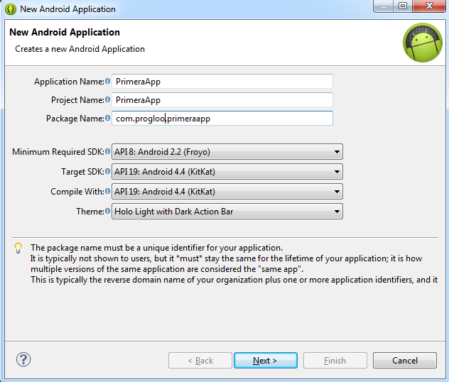
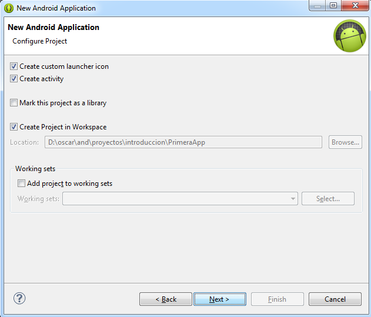
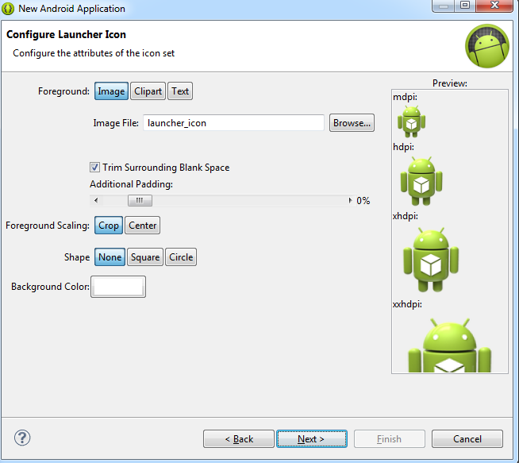
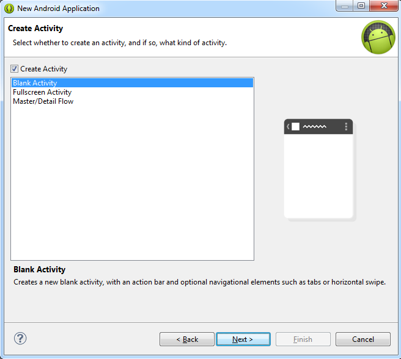
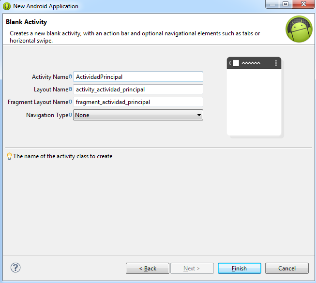
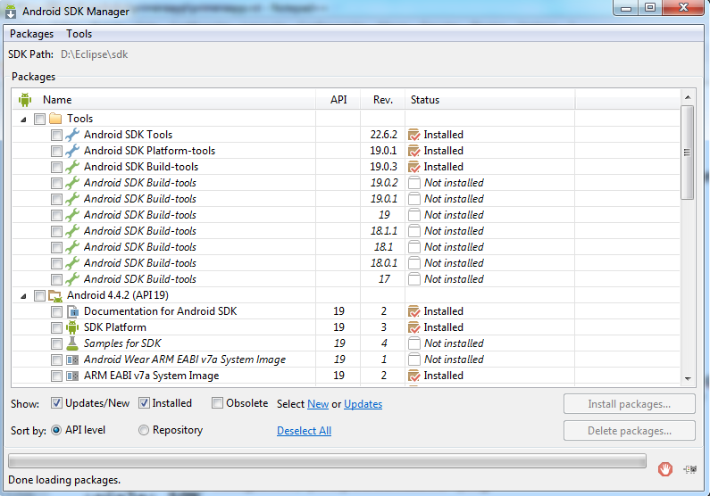
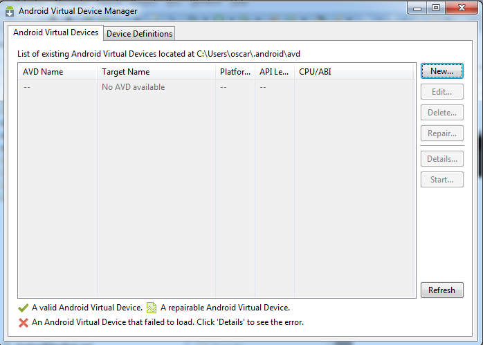
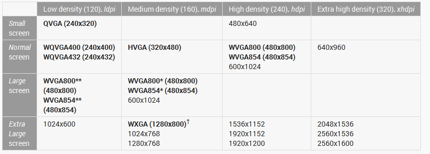
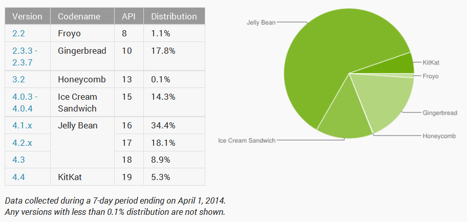
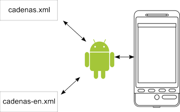

.. Apuntes de móviles documentation master file, created by
   sphinx-quickstart on Thu Sep 18 23:23:41 2014.
   You can adapt this file completely to your liking, but it should at least
   contain the root `toctree` directive.

Prog. multimedia y de dispositivos móviles.
==============================================

Índice:

.. toctree::
   :maxdepth: 2
   
Análisis de tecnologías para aplicaciones en dispositivos móviles:
=======================================================================

Puntos iniciales
-----------------

* En primer lugar, en http://10.8.0.253 se puede encontrar un servidor.

* Los apuntes también se podrán encontrar a diario en http://oscarmaestre.github.io

* Existen fotocopias con la programación, criterios, etc... en la mesa del profesor. En cualquier caso, están colgadas en la página del centro http://www.iesmaestredecalatrava.es (buscar el apartado "Presentaciones"

* Si se desea acceder a algún fichero individual de los apuntes puede hacerse en las página siguiente

	* https://github.com/OscarMaestre/Moviles
	* https://github.com/OscarMaestre/ServiciosYProcesos

Sistemas operativos para dispositivos móviles. Características.
-------------------------------------------------------------------------------	
	
El desarrollo para la telefonía móvil es un campo que se encuentra en plena expansión. El número de teléfonos no deja de crecer y las necesidades de programación de los mismos tampoco. En ese sentido existen diversas plataformas de desarrollo a tener en cuenta al empezar a programar.

* Android: es el más numeroso de lejos. La mayor parte del mercado usa esta plataforma. El hecho de que Google ofrezca *completamente gratis* el sistema operativo para los fabricantes y el entorno para los programadores lo ha hecho crecer hasta desbancar a su competidor. Google solo se ocupa de la venta de apps y ese es su nicho de beneficios.
* iOS: Utiliza una filosofía completamente distinta que es controlar todo el proceso desde el desarrollo hasta la distribución de aplicaciones. Ese control se hace por medio del pago de licencias y de la unicidad de la distribución.
* Windows Phone: es el sistema de Microsoft que ha lanzado más o menos recientemente y que aún está por ver si consigue una cuota de mercado significativa o no.
* FirefoxOS: se centra principalmente en mercados emergentes (con el objetivo a largo plazo de ganar cuota de mercado) su filosofía es la misma del software libre.
* Bada: Es la plataforma de Samsung creada exclusivamente para sus teléfonos. Es muy poco usada fuera de Corea del Sur.
* Symbian: surge de un antiguo sistema creado para las PDA, está prácticamente descatalogado en el desarrollo para telefonía móvil.
* Tizen: una plataforma relativamente nueva. Al igual que Android es gratis y además tiene el respaldo de Intel.
* Jolla: surge en los países nórdicos con una filosofía similar al software libre pero con la salvedad de que, de momento, solo se ejecuta en sus teléfonos (que son de gama alta)

En cuanto a la tecnología hay diferencias sustanciales entre ellas:

* Android: pensado principalmente para ser programado en Java (aunque se puede llegar a usar C++ con un kit aparte).
* iOS: usa Objective-C que lo separa mucho del resto de plataformas. El entorno exige el pago de una licencia, el SO exige una licencia y el poner aplicaciones a la venta exige otra.
* Windows Phone: usa Visual Studio que es una herramienta muy potente y usa la plataforma .NET.
* FirefoxOS: usa HTML y Javascript.
* Symbian y otros también permiten el uso de HTML y JS.
* Tizen permite dos opciones: C++ o HTML/JS
* Jolla/Sailfish: usa C++.
* Bada usa C++.

En este curso se usara Android con Java como lenguaje de desarrollo.

Limitaciones
------------------------------------------------------

Programar un teléfono móvil implica preparar nuestro programa para situaciones que no son de importancia en los ordenadores de escritorio o que incluso no existen.

* Desconexión: un teléfono puede perder el fluido eléctrico sin aviso o perder la conexión de red de forma repentina.

* Seguridad: un teléfono puede ser accesible desde cualquier punto del planeta lo que puede poner en grave riesgo la privacidad del usuario.

* Memoria: la cantidad de memoria de estos dispositivos es mucho más reducida que los equipos de escritorio.

* Consumo batería: la cantidad de código que se ejecuta implica disminuir la cantidad de batería del usuario.

* Almacenamiento: la cantidad de espacio para almacenar ficheros en estos dispositivos es muy variable y a veces prácticamente inexistente.

Entornos integrados de trabajo.
------------------------------------------------------

En este apartado vamos a hablar de los distintos entornos que se pueden usar para programar teléfonos móviles.

* Eclipse.
* XCode para iOS.
* Android Studio.
* NetBeans.
* Visual Studio (para Windows Phone).
* ¿Visual Kaffe?
* Línea de comandos.
* Appcelerator.

Android Studio
-------------------------------------------------
Android Studio es el entorno oficial de programación de Google. Como tal, es probablemente la herramienta del futuro si bien tiene diversas desventajas.

* Aún está en fase beta y según los documentos de instalación aún puede cambiar mucho sin previo aviso.
* Requiere una máquina más potente que los otros: de no ser así el proceso de edición-compilación-ejecución se vuelve demasiado lento.

Eclipse
-------------------------------------------------

Eclipse ha sido desde los comienzos la herramienta ofrecida por Google para programar en Android. De hecho, en su página se ofrece el "Android Developer Tools Bundle" que contiene absolutamente todo lo necesario para trabajar.

.. INFO::
   Aún así, despues de descargarlo, aún tendremos que bajar e instalar la(s) plataforma(s) Android para las cuales queramos programar, lo que en sitios con una línea de baja velocidad aún requerirá un tiempo apreciable.

En este manual será la herramienta que se utilizará para los ejemplos.

   
La línea de comandos
-------------------------------------------------

La línea de comandos es el entorno más ligero. Además ofrece grandes ventajas en cuanto a la automatización de tareas, y de hecho Google ofrece el kit de desarrollo adaptado a la línea de comandos. El inconveniente principal es que algunos desarrolladores no están muy acostumbrados a ella.

El primer proyecto
------------------------------------------------------

Cuando se instala el Android Developer Bundle y se arranca Eclipse podremos utilizar un pequeño asistente para crear la primera aplicación. Para ello, en el menú ``File-New`` elegiremos la opción ``Android Application Project``, mostrándonos una ventana que debería ser parecida a la siguiente figura.

   
   Datos iniciales de la aplicación Android
   
En ella deberemos prestar atención a los siguientes elementos:

* *Minimum required SDK* : es la versión de Android mínima que necesitará en su móvil/tablet quien desee instalar la aplicación. Si se tiene la tentación de poner la versión 1.0 se debe tener en cuenta que también se dispondrán de menos clases y métodos para construir la app. La versión 8 (Android 2.1) es un valor razonable a día de hoy.

* *Target SDK* : es la versión de Android para la cual hemos optimizado la aplicación. En todo este manual se usará la versión 19 de Android (o Android 4.4)

* *Compile with* : Android tiene varias versiones y podemos utilizar una versión posterior para optimizar una aplicación orientada a un Android más antiguo. Sin embargo, normalmente no lo haremos y usaremos la misma versión que en el Target SDK, es decir, la 19.

* *Theme* : las aplicaciones pueden tener diversos temas o "skins". Google ofrece algunos estilos predeterminados, pero no haremos especial hincapie en el diseño, solo en la programación. Usaremos el estilo por defecto "Holo Light".

Despues de haber rellenado estos datos podremos ver algo como esto:

   
   Opciones específicas del proyecto
   
   Aquí podremos indicar si queremos crear una biblioteca en lugar de una aplicación, si deseamos que se cree una actividad en blanco y si queremos ponerlo en el directorio de trabajo predeterminado. Se dejarán las opciones por defecto.

   
   Personalizando el icono
   
   Esta ventana permite elegir algunas opciones sobre el icono de la aplicación:
   

   
   Tipo de actividad
   
   Aquí se puede elegir qué tipo de actividad se desea. En general, usaremos una actividad en blanco.

   
   Datos de la actividad
   
   En este último paso se indicará el nombre de la clase que contendrá la actividad principal de la aplicación. Usaremos el nombre ``ActividadPrincipal`` y terminaremos el asistente.
   
   

.. figure:: imagenes/proyectovacio.png
   :scale: 50%
   :align: center
   :figwidth: 50%
   
   Un proyecto vacío de Android
   
   El asistente terminará y se nos mostrará el entorno de Eclipse.

Descargando plataformas
-------------------------------------------------

Una vez hecho esto se debería instalar alguna versión del kit de desarrollo Android para empezar a programar. Para ello, se debe arrancar el gestor de plataformas Android mediante el menú de Eclipse ``Window->SDK Manager``

   
   Administrador de plataformas Android

El SDK Manager hace unas cuantas recomendaciones bastante prácticas: normalmente intentará instalar la última versión de Android más algunas herramientas útiles.

.. WARNING::
   Una de las herramientas que se descargará es *Intel x86 Emulator Accelerator* o HAXM. `Esta herramienta de Intel <http://software.intel.com/en-us/android/articles/intel-hardware-accelerated-execution-manager>`_ permite acelerar la ejecución del emulador de Android en microprocesadores Intel que tengan activada en su BIOS la opción de aceleración. Puede ser necesario habilitar esta opción en la BIOS (probablemente en alguna opción con el nombre ``Enable Intel VT-x`` o similar). El uso de HAXM es **MUY RECOMENDABLE**. Por otro lado, el SDK Manager descarga, pero no descomprime ni instala HAXM. Se debe buscar el ZIP en el directorio de instalación y ejecutarlo.
   
  
   
En líneas generales se necesitarán:

* Todos los archivos de la última plataforma
* El driver USB, que permitirá ejecutar nuestros programas en un móvil/tablet conectado por USB al equipo
* El driver HAXM
* La biblioteca de soporte de Android: permite que programas con una versión moderna se ejecuten en algunas plataformas más antiguas, entre otras cosas.
* Las *build-tools* o herramientas de compilación.
* Las *platform-tools* o herramientas específicas de la plataforma.
* Las *Android tools*, herramientas específicas de Android 

Creando emuladores
-------------------------------------------------

Cuando se haya completado el paso anterior, se podrán crear *Android Virtual Devices* o AVDs o emuladores. Se pueden crear dispositivos con diferentes características como se muestra a continuación.

En primer lugar, se debe elegir la opción ``Window-Android Virtual Device Manager``, con lo que ser verá una herramienta que permite crear emuladores.

   
   El Android Virtual Device Manager
   
   
.. figure:: imagenes/creandoavd.png
   :align: center
   :figwidth: 50%
   
   Creando dispositivos
   
   Una vez arrancado se podrá crear un nuevo dispositivo con el botón *New*. Se recomienda mantener estas opciones.
   
   
Arrancando el programa
-------------------------------------------------

Una vez que se tiene el emulador creado, se puede arrancar con el botón Start, y despues arrancar el proyecto vacío Android de Eclipse. Para ello, una posibilidad es hacer click con el botón derecho en el proyecto que vemos a la izquierda de Eclipse y elegir el menu ``Run As-Android Application``. Debería arrancarse la aplicación en el emulador y ver el resultado.

.. figure:: imagenes/ejecutandovacio.png
   :scale: 50%
   :align: center
   :figwidth: 50%
   
   Ejecutando el primer proyecto
   
   
.. figure:: imagenes/primeraapp.png
   :scale: 50%
   :align: center
   :figwidth: 50%
   
   Emulador ejecutando la primera app

Módulos para el desarrollo de aplicaciones móviles.
------------------------------------------------------

En este curso, realmente solo necesitaremos Java para crear apps. Sin embargo, existen un montón de bibliotecas que permiten acelerar el desarrollo para diversos lenguajes y distintas tareas. Solo por nombrar algunos mencionaremos:

* Unity para desarrollar juegos.
* JQuery para Javascript.
* Bibliotecas para tareas muy específicas como la seguridad SSL y similares.

Emuladores.
------------------------------------------------------

A la hora de probar un app suele ser posible utilizar un emulador cargado en el sistema operativo que facilite la tarea de depurar la aplicación.

En Android, Google proporciona un sistema completo de emulación basado en máquinas virtuales (no usa VirtualBox sino un programa similar llamado QEMU).

El sistema de emulación permite crear dispositivos de características muy variadas para probar nuestra app en distintos entornos. Google denomina a estos dispositivos Android Virtual Devices (o AVDs)

* Se puede modificar el tamaño y la resolución.
* La memoria RAM y espacio en tarjeta SD.
* Se puede poner o quitar cámara.
* Existen dispositivos predefinidos por Google que permiten crear emuladores muy rápidamente.
* También se pueden clonar dispositivos para hacer solo una modificación de forma rápida.
* Una característica de interés es que *si se dispone de una tarjeta gráfica con aceleración* se puede activar una casilla llamada "Host GPU" que permite acelerar la emulación.
* Se puede obligar al emulador a que "recuerde" el estado en que se quedó para así continuar donde nos hubiésemos quedado el último día. Esta opción se llama instantánea o *snapshot*.

Si el equipo de escritorio es un Intel se puede instalar el Hardware Accelerated eXecution Manager o HAXM que permite acelerar la emulación. En el directorio ``sdk/extras/intel`` se puede encontrar un archivo ZIP que contiene un EXE que instala el HAXM. Se recomienda encarecidamente instalarlo en casa y, si es necesario, habilitar la tecnología VT en la BIOS.

Ciclo de vida
------------------------------------------------------

.. figure:: imagenes/ciclodevida.png
   :figwidth: 50%
   :align: center
   
   Pasos en la ejecución de una app (imagen tomada de Google).

Configuraciones y perfiles
-------------------------------------------------------------------------------

Tamaños y densidades
------------------------------------------------------

Como ya se ha mencionado, la plataforma Android establece diversas categorías de dispositivo en función del tamaño y la densidad/resolución:

* En tamaños se distingue entre *small* , *normal*, *large* y *xlarge*.

* En densidades se distingue entre *ldpi*, *mdpi*, *hdpi* y *xhdpi*.

.. INFO::
   Un cambio en la orientación del dispositivo **también se considera un cambio en el tamaño del dispositivo**.
   

   
   Tamaños de pantalla (imagen tomada de Google)   

   
Directorios
------------------------------------------------------

Para que nuestra aplicación ofrezca soporte a todas estas variantes tan solo se deben utilizar distintos directorios ``layout`` dentro del subdirectorio ``res``. Así, si queremos crear una configuración de interfaz diferente para pantallas grandes podemos crear un subdirectorio ``res/layout-large`` que contenga un interfaz diferente optimizada para pantallas grandes. 

Como puede verse, la clave consiste en utilizar directorios ``layout-xxx`` donde *xxx* pueden ser una serie de sufijos.

* ``res/layout`` es el directorio que se usará para el interfaz por defecto que asume orientación vertical.
* ``res/layout-large`` para pantallas grandes.
* ``res/layout-xlarge`` para pantallas muy grandes.
* ``res/layout-large-land`` para pantallas muy grandes giradas para estar en horizontal (landscape).

Imágenes
------------------------------------------------------
Cuando se tiene la previsión de que la aplicación se va a ejecutar en muchos dispositivos diferentes se deben crear diferentes versiones de las imágenes usadas.

Lo ideal es disponer de las imágenes en formato vectorial y utilizar las siguientes escalas:

* Para resoluciones *mdpi*, la imagen a escala 1.
* Para *ldpi*, la imagen a escala 0.75
* Para *hdpi*, se escala a 1.5
* Para *xhdpi*, la escala debe ser 2.
* Y así sucesivamente.

Normalmente ya no es necesario poner nada para *ldpi* por dos motivos.

1. En la actualidad suponen un porcentaje muy pequeño de los dispositivos.
2. Android puede hacer la escala automáticamente.

Aunque en este manual se habla en general de Android 4 conviene no perder de vista las plataformas anteriores. Google mantiene una pequeña tabla con `los porcentajes de uso de las diversas versiones de Android  <http://developer.android.com/about/dashboards/index.html>`_ ya que crear nuestra aplicación *exclusivamente para cierta versión y las posteriores* hará que nos autoexcluyamos de una porción del mercado que puede ser muy significativa.

   
   Porcentajes de uso de Android (tomada de Google el 4-4-2014)
   
   
   
   
Ejercicios
------------------------------------------------------

1. Crea una aplicación que se vea de tres formas distintas en función de que la pantalla sea normal, grande o muy grande

2. Haz que la aplicación anterior muestre datos sobre la plataforma sobre la que se está ejecutando. (Pista, deberás implementar *forzosamente* un método ``protected void onStart()``)   

Para resolver estos ejercicios necesitarás leer los apartados siguientes sobre directorios y recursos.

Directorios
------------------------------------------------------

Como ya se ha introducido anteriormente ciertos elementos que pueden cambiar no deberían estar dentro del código, sino en *recursos* (es decir, en ficheros externos que puedan cargarse en tiempo de ejecución). Un ejemplo muy elemental son las cadenas: si queremos ofrecer soporte a varios idiomas, es mejor tener todas las cadenas en un fichero, de forma que si queremos traducir la aplicación, bastará con traducir dicho fichero y hacer que la aplicación cargue distintos ficheros en función el idioma.

   
   Un mismo código fuente, distintas cadenas (Imagen de `shokunin <http://openclipart.org/user-detail/shokunin>`_ ).
      

Veamos un ejemplo muy simple. Supongamos que la aplicación saluda al usuario en el momento del arranque. Podríamos usar este código Java.

.. code-block:: java

	public class Actividad{
		private final String saludo="Hola";
	}
	
Sin embargo, al hacerlo así, la traducción de la aplicación se vuelve muy compleja. Sin embargo, podemos almacenar las cadenas en un fichero de recursos como ``strings.xml``de esta forma.

.. code-block:: xml

	<string id="saludo">Hola</string>
	
Si ahora en el código Java cargamos la cadena (en pseudocódigo)...

.. code-block:: java

		public void saludar(){
			String saludo=R.string.saludo;
		}
		
...ahora la traducción es muy sencilla, ya que basta con tener otro fichero en la aplicación con las cadenas en inglés:

.. code-block:: xml

	<string id="saludo">Hello</string>
	
*Y no habrá que tocar nada del código Java*. De hecho, Android compilar los recursos para que sean fácilmente accesibles desde código Java. En este capítulo se analiza como usar los recursos.

Tipos de recursos
------------------------------------------------------

Todos los recursos se definen en forma de XML y *deben* ir dentro de uno de estos subdirectorios que hay dentro de ``res``:

* ``res/animator``: contiene los ficheros XML que especifican animaciones. Se verá más sobre animaciones más adelante.
* ``res/anim``: aquí se pondrán unos tipos especiales de animación llamadas "tween animation" que permiten a Android generar la animación a partir de información tal como "punto inicial", "punto final" y "duración de la animación".
* ``res/color``: define los colores de nuestra aplicación.
* ``res/drawable``: para especificar los archivos de imagen usados (en formatos .png, .9.png, .jpg y .gif)
* ``res/layout``: para indicar la colocación de recursos en pantalla en los distintos tamaños de pantalla.
* ``res/menu``: define los menús de aplicación.
* ``res/raw``: recursos almacenados en formato binario. Pueden cargarse con ``Resources.openRawResource()``
* ``res/values``: ficheros XML que contienen valores simples como números, cadenas o incluso colores. Aunque en realidad aquí se pueden usar los nombres de fichero que queramos la costumbre es usar estos nombres:

	* arrays.xml: permite crear vectores de recursos.
	
	* colors.xml: para colores.
	
	* dimens.xml: para especificar tamaños.
	
	* strings.xml: para cadenas.
	
	* styles.xml: para estilos
	
	
* ``res/xml``: aquí se almacena cualquier otro fichero XML que se desee. Los ficheros en este directorio pueden cargarse usando ``Resources.getXML()``

Existe una última posibilidad para almacenar recursos, que es usar el directorio ``assets`` (no es ``res/assets``) sin embargo, Android no compila dichos recursos automáticamente. Deben cargarse con la clase AssetsManager.

Indicando recursos alternativos
-------------------------------------------------
Por ejemplo, ya sabemos que el archivo ``res/values/strings.xml`` contiene las cadenas que se mostrarán por defecto. Si esas cadenas están en español y deseamos indicar que se carguen otras cadenas para el idioma inglés se deben indicar modificadores para el directorio ``values``.

* ``res/values-en/strings.xml`` indicaría el fichero de cadenas para el idioma inglés.
* ``res/values-fr/strings.xml`` para francés.
* Se puede usar cualquier `código ISO 639-1 <http://www.loc.gov/standards/iso639-2/php/code_list.php>`_ para indicar el idioma.

Los modificadores se pueden añadir a cualquier subdirectorio de los vistos antes, además se pueden poner varios a la vez pero siempre respetando este orden:

1. MCC (Mobile Country Code o código de país) y MNC (Mobile Network Code o código de red). Pueden consultarse las distintas redes y países en `Wikipedia <http://es.wikipedia.org/wiki/MCC/MNC>`_ . Por ejemplo para indicar un recurso específico de un teléfono Android usado en territorio español se usaría ``mcc214`` y para indicar específicamente un recurso en un Android que accede desde Movistar se usaría ``mcc214-mnc07``.  

2. Idioma y región: se usa un código de páis ISO 639-1 que puede o no ir seguido de una "r" y un código de región. Así el modificador "en" indica idioma inglés y "fr" francés, pero "fr-rFR" indica francés de Francia y "fr-rCA" francés de Canadá. Pueden consultarse los códigos de país en `Wikipedia <http://en.wikipedia.org/wiki/List_of_ISO_639-1_codes>`_ 

3. Dirección de lectura: ``ldrtl`` para cuando el idioma del dispositivo se lee de derecha a izquierda (right-to-left) y ``ldltr`` para lectura de izquierda a derecha. Obsérvese que ya podriamos indicar un fichero ``res/values-mcc214-fr-rCA/strings.xml`` para indicar los textos que debe usar un teléfono Android con su idioma puesto a francés (de Canadá) que sin embargo usa una red española. Sin embargo ``res/values-fr-mcc214/strings.xml`` estaría mal ya que aunque el idioma y el territorio son correctos los hemos puesto al revés (sería ``res/values-mcc214-fr``)

4. Anchura mínima del dispositivo: se usa ``swNdp`` donde N es el número mínimo de puntos que debe tener la anchura de la pantalla. También puede indicarse este valor en el ``AndroidManifest.xml`` con el atributo ``android:requiresSmallestWidthDp``Si indicamos varios directorios, Android escogerá siempre el valor de N más pequeño y cercano a la anchura del dispositivo **independientemente de si la pantalla se gira o no**. Algunos valores típicos son:

	* sw320dp: para pantallas de 240x320 (ldpi), de 320x480 (mdpi) o de 480x800 (hdpi)
	
	* sw480dp: para 480x800 (mdpi)
	
	* sw600dp: para 600x1024 (mdpi)
	
5. Anchura disponible: el sufijo ``wNdp`` indica la anchura que la aplicación necesita **teniendo en cuenta si la pantalla se gira** (esta es la diferencia con respecto al anterior). 

6. Altura disponible: el sufijo ``hNdp`` indica la altura que la aplicación necesita.

7. Tamaño de pantalla: pueden usarse los sufijos siguientes:

	* ``small`` de aproximadamente 320x426
	
	* ``normal`` aproximadamente 320x470
	
	* ``large`` de unos 480x640
	
	* ``xlarge`` con un tamaño de 720x960 (normalmente tablets)
	
8. Aspecto de la pantalla: ``long``	para pantallas WQVGA, WVGA, FWVGA y ``notlong`` para QVGA, HVGA, and VGA. No tiene nada que ver con la orientación de la pantalla.

9. Orientación de la pantalla: ``port`` (portrait) para cuando la pantalla está en vertical y ``land`` (landscape) para cuando está en horizontal.

10. Modo del interfaz de usuario:

	* ``car`` cuando el dispositivo está en un coche.
	* ``desk`` en un escritorio
	* ``television``
	* ``appliance`` el dispositivo es una herramienta y no tiene pantalla.
	
11. Modo nocturno: ``night`` y ``notnight`` dependiendo de si el dispositivo está en modo nocturno o no.

12. Densidad de pixeles: (la escala entre los principales tamaños es 3:4:6:8)

	* ldpi: pantallas de baja densidad, aproximadamente 120dpi.
	* mdpi: densidad media, unos 160dpi.
	* hdpi: alta densidad, unos 240dpi.
	* xhdpi: densidad "extra-alta", unos 320dpi.
	* nodpi: Usado para recursos para los que no queremos que Android haga el escalado.
	* tvdpi: unos 213 (entre ``mdpi`` y ``hdpi``)

13. Tipo de pantalla: ``finger`` para dispositivos táctiles y ``notouch`` para los demás.

14. Disponibilidad de teclado:

	* ``keysexposed``: hay teclado hardware.
	* ``keyshidden``: hay teclado hardware pero no está disponible y además *no hay teclado software*.
	* ``keyssoft``: hay teclado software.

15. Método de entrada: ``nokeys`` cuando no hay teclado hardware, ``qwerty`` si hay un teclado hardware y ``12key`` para teclados hardware de 12 teclas.

16. Disponibilidad de teclas de navegación: 

	* ``nonav``: no se puede navegar con teclas.
	* ``dpad``: hay un pad direccional.
	* ``trackball``: hay un trackball.
	* ``wheel``:  hay un ratón con rueda (poco habitual).
	
17. Versión de la plataforma Android: ``v3``, ``v4``, ``v9`` etc...

Ejercicio
------------------------------------------------------

¿Como debería llamarse un directorio que contuviera recursos específicos para un teléfono en portugués que esté usándose en Francia con el operador Bouygues Telecom y que fuera un dispositivo de una resolución hdpi?

Respuesta: hay que ir nombrando el directorio con los sufijos correctos en el orden correcto. En este caso sería ``values-mcc208-mnc20-pt-hdpi``.

Tamaños y densidades
------------------------------------------------------

En la tabla siguiente, tomada de la documentación oficial de Google pueden verse los tamaños y densidades aproximados de los distintos tipos de pantalla que podemos encontrar.

   
   Tamaños de pantalla reconocidos (imagen tomada de Google)

Accediendo a los recursos
------------------------------------------------------

Cuando se crea un recurso puede accederse al mismo por medio de la clase especial ``R`` la cual es creada por la herramienta ``aapt``. Dicha herramienta toma todos los recursos y crea distintas subclases para facilitar el uso de dichos recursos. Las clases creadas son:

* R.drawable: para acceder a archivos de imagen.
* R.id: para acceder al id de un control.
* R.layout: para cargar disposiciones de controles.
* R.string: para acceder a cadenas.

Aí, por ejemplo si un archivo de imagen ubicado en ``res/drawable/icono.png`` quiere ponerse de fondo en algún control se usará la sentencia:

.. code-block:: java

	control.setBackgroundDrawableResource(
		R.drawable.icono);
		
Por otro lado, si deseamos usar un recurso XML en otro archivo XML se puede hacer usando la siguiente estructura:

1. Empezar siempre por ``@``		
2. Si se desea acceder a un recurso en otro paquete poner el nombre seguido de ``:``, como ``com.ejemplo:``.
3. Despues se indica el tipo de recurso, ``string``, ``drawable``...
4. Despues se indica el nombre del recurso.

Supongamos que tenemos un fichero genérico con distintas definiciones de recursos como este:

.. code-block:: xml

	<?xml version="1.0" encoding="utf-8"?>
	<resources>
	   <color name="color_corporativo">#f00</color>
	   <string name="saludo">Hola</string>
	</resources>   
	
Y que deseamos usar este color y este texto en interfaz. El XML sería así:

.. code-block:: xml

	<?xml version="1.0" encoding="utf-8"?>
	<EditText
		xmlns:android=
		  "http://schemas.android.com/apk/res/android"
		android:layout_width="fill_parent"
		android:layout_height="fill_parent"
		android:textColor="@color/color_corporativo"
		android:text="@string/saludo" />   	
	
	
Por último mencionar que Android dispone de muchos otros recursos a los cuales se puede acceder usando el prefijo ``android``. Así, por ejemplo, Android define un interfaz para elementos en una lista que podemos usar con este código (obsérvese que Android llama a este interfaz ``simple_list_item_1``):

.. code-block:: java

	setListAdapter(
		new ArrayAdapter<String>(
			this, 
			android.R.layout.simple_list_item_1, 
			vector
		)
	);	

Gestión de cambios durante la ejecución
------------------------------------------------------

Android puede decidir reiniciar nuestra app por diversos motivos:

* El usuario ha cambiado el idioma.
* La pantalla ha rotado por ejemplo de vertical a horizontal.
* Se ha conectado un teclado
* Etc...

En estos casos, Android llamará a nuestro método ``onDestroy`` y despues a ``onCreate``. Sin embargo, un usuario podría llegar a perder trabajo, por lo cual una actividad puede usar si lo desea dos métodos que Android llamará.

* ``onSaveInstanceState``: podemos implementarlo para guardar el trabajo que haya hecho.
* ``onRestoreInstanceState``: Android puede usarlo para restaurar el estado.

Sin embargo, ¿qué ocurre si esto implica grabar y cargar grandes cantidades de datos?: podría ocurrir que la aplicación se ralentizara, dando una pobre experiencia de usuario. En este caso hay dos opciones:

1. Retener un objeto en memoria durante la reinicialización.
2. Gestionar el cambio por nosotros mismos tomando el control de Android.

En cualquier caso, Android suele recordar automáticamente los elementos de la interfaz de usuario, por lo que lo que llamamos "reiniciar" la actividad en realidad no es un reinicio absoluto.

Reteniendo objetos en memoria
------------------------------------------------------
El método ``onCreate`` de una actividad siempre acepta un objeto ``Bundle`` en el que puede estar el estado anterior de nuestra actividad. Sin embargo, este objeto no está diseñado para almacenar grandes cantidades de datos. 

Por todo ello, la clase Fragment permite ejecutar ``setRetainInstance(true)`` en el método ``onCreate``y así evitar la destrucción y re-creación de la actividad.

	

Gestionando el cambio
------------------------------------------------------
Se puede implementar el método `` onConfigurationChanged()`` para gestonar los cambios por nosotros mismos.

.. DANGER::
   Implementar este método debería ser *la última opción* ya que tendremos que reaplicar todos los cambios por nosotros mismos (cargar cadenas, interfaces, etc...)

	
Ejercicios
------------------------------------------------------

1. ¿Qué diferencia hay entre ``sw320dp`` y ``w320dp``?.
2. Si una imagen mide 30x30 en el tamaño ``ldpi``, ¿cuanto medirá en ``mdpi``, ``hdpi`` y ``xhdpi``?.

Modificación de aplicaciones existentes.
------------------------------------------------------

Utilización del entorno de ejecución del administrador de aplicaciones.
-------------------------------------------------------------------------------

Programación de aplicaciones para dispositivos móviles
========================================================

Herramientas y fases de construcción.
------------------------------------------------------

Interfaces de usuario. Clases asociadas.
------------------------------------------------------
Servicios en dispositivos móviles.
------------------------------------------------------
Proveedores de contenido.
------------------------------------------------------
Gestión de recursos y notificaciones.
------------------------------------------------------
Contexto gráfico. Imágenes.
------------------------------------------------------
Eventos del teclado.
------------------------------------------------------
Técnicas de animación y sonido.
------------------------------------------------------
Descubrimiento de servicios.
------------------------------------------------------
Bases de datos y almacenamiento.
------------------------------------------------------
Persistencia.
------------------------------------------------------
Modelo de hilos.
------------------------------------------------------

Comunicaciones: clases asociadas. Tipos de conexiones.
------------------------------------------------------
Gestión de la comunicación inalámbrica.
------------------------------------------------------
Seguridad y permisos.
------------------------------------------------------
Envío y recepción de mensajes texto.
------------------------------------------------------
Envío y recepción de mensajería multimedia. Sincronización de contenido.
-------------------------------------------------------------------------------
Manejo de conexiones HTTP y HTTPS.
------------------------------------------------------
Empaquetado y despliegue de aplicaciones para dispositivos móviles.
-------------------------------------------------------------------------------
Centros de distribución de aplicaciones.
------------------------------------------------------
Documentación de aplicaciones de dispositivos móviles.
------------------------------------------------------

Utilización de librerías multimedia integradas
===================================================

Conceptos sobre aplicaciones multimedia.
------------------------------------------------------

Arquitectura del API utilizado.
------------------------------------------------------

Fuentes de datos multimedia. Clases.
------------------------------------------------------

Datos basados en el tiempo.
------------------------------------------------------

Procesamiento de objetos multimedia. Clases. Estados, métodos y eventos.
-------------------------------------------------------------------------------

Reproducción de objetos multimedia. Clases. Estados, métodos y eventos.
-------------------------------------------------------------------------------

Depuración y documentación de los programas.
------------------------------------------------------

Análisis de motores de juegos
===================================================

Animación 2D y 3D.
------------------------------------------------------

Arquitectura del juego. Componentes.
------------------------------------------------------

Motores de juegos: Tipos y utilización.
------------------------------------------------------

Áreas de especialización, librerías utilizadas y lenguajes de programación
--------------------------------------------------------------------------

Componentes de un motor de juegos.
------------------------------------------------------

Librerías que proporcionan las funciones básicas de un Motor 2D/3D.
--------------------------------------------------------------------------

APIs gráficos 3D.
------------------------------------------------------

Estudio de juegos existentes.
------------------------------------------------------

Aplicación de modificaciones sobre juegos existentes.
------------------------------------------------------

Desarrollo de juegos 2D y 3D
===================================================

Entornos de desarrollo para juegos.
------------------------------------------------------

Integración del motor de juegos en entornos de desarrollo.
--------------------------------------------------------------

Conceptos avanzados de programación 3D.
------------------------------------------------------

Fases de desarrollo:
------------------------------------------------------

Propiedades de los objetos: luz, texturas, reflejos, sombras.
---------------------------------------------------------------------

Aplicación de las funciones del motor gráfico. Renderización.
----------------------------------------------------------------

Aplicación de las funciones del grafo de escena. 
------------------------------------------------------

Tipos de nodos y su utilización.
---------------------------------------------------------------------------------

Asociación de sonidos a los eventos del juego.
------------------------------------------------------

Análisis de ejecución. Optimización del código.
------------------------------------------------------

Documentación de la fase de diseño y de desarrollo.
------------------------------------------------------

Sistemas basados en localización
===================================================

Tecnologías de localización (GPS, A-GPS,...).
------------------------------------------------------

Servicios de localización, mapas y geocodificación.
------------------------------------------------------

Emuladores para simular las ubicaciones.
------------------------------------------------------

Visualización la información geolocalizada.
------------------------------------------------------
