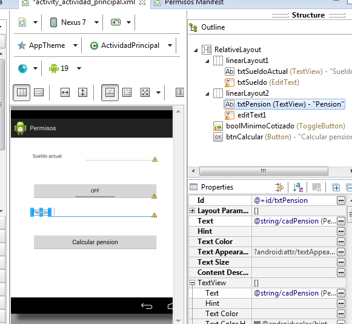

Programación de aplicaciones para dispositivos móviles
========================================================

Herramientas y fases de construcción.
------------------------------------------------------
La principal herramienta para programar aplicaciones Android es Eclipse aunque hoy en día está empezando a ser reemplazada por Android Studio.

En primer lugar se debe hacer un análisis de los permisos que deberá necesitar nuestra aplicación.

Todos los permisos que requiera nuestra aplicación se indican en el principal fichero del proyecto: ``AndroidManifest.xml``

El archivo ``AndroidManifest.xml`` es un archivo imprescindible en cualquier aplicación Android, debe tener siempre ese nombre y debe estar en el directorio raíz del proyecto. Este fichero sirve para lo siguiente:

* Identifica el paquete Java de la aplicación, que se usará como identificador único de la misma.

* Describe los componentes de la aplicación: actividades, servicios, etc...

* Determina qué procesos alojarán componentes de la aplicación.

* Declara los permisos que debe tener la aplicación para acceder al hardware o al software del sistema.

* Declara los permisos que otros componentes deben tener para interactuar con los componentes de nuestra aplicación.

* Identifica las clases ``Instrumentation`` que se usarán para monitorizar el rendimiento. Normalmente esto solo se hace mientras estamos en pruebas, después se elimina.

* Indica la versión mínima de Android que se necesita para ejecutar nuestra app.

* Indica las bibliotecas con las que enlaza nuestro programa.

Un ``AndroidManifest.xml`` tiene esta estructura:

.. code-block:: xml

	<?xml version="1.0" encoding="utf-8"?>

	<manifest>

		<uses-permission />
		<permission />
		<permission-tree />
		<permission-group />
		<instrumentation />
		<uses-sdk />
		<uses-configuration />  
		<uses-feature />  
		<supports-screens />  
		<compatible-screens />  
		<supports-gl-texture />  

		<application>

			<activity>
				<intent-filter>
					<action />
					<category />
					<data />
				</intent-filter>
				<meta-data />
			</activity>

			<activity-alias>
				<intent-filter> . . . </intent-filter>
				<meta-data />
			</activity-alias>

			<service>
				<intent-filter> . . . </intent-filter>
				<meta-data/>
			</service>

			<receiver>
				<intent-filter> . . . </intent-filter>
				<meta-data />
			</receiver>

			<provider>
				<grant-uri-permission />
				<meta-data />
				<path-permission />
			</provider>

			<uses-library />

		</application>

	</manifest>   
	
``<uses-permission>``	
------------------------------------------------------
Indica que la app necesita que se le conceda un cierto permiso para poder ser instalada y ejecutada. El permiso se indica en el atributo ``android:name`` con un valor como ``android.permission.CAMERA``.

También puede llevar un atributo ``android:maxSdkVersion`` con el que se indica la versión máxima de Android donde es necesario pedir el permiso. Se usa en los casos en los que un permiso deja de existir. Eclipse suele rellenar este valor con la misma versión que usamos para el desarrollo.

Un posible valor:

.. code-block:: xml

   <uses-permission
     android:name="android.permission.WRITE_EXTERNAL_STORAGE"
     android:maxSdkVersion="18" />

	 
	
	
Después de construir el ``AndroidManifest.xml``	se debería realizar un boceto de como va a ser el interfaz. Aunque se indique de esta forma, el ``AndroidManifest.xml`` puede volver a modificarse en el futuro. Hay aplicaciones que permiten elaborar el "wireframe" de nuestro interfaz, pero Eclipse también puede ayudar mucho en esta tarea.	
	
	

Interfaces de usuario. Clases asociadas.
------------------------------------------------------

Ejercicio
~~~~~~~~~~~~~~~~~~~~~~~~~~~~~~~~~~~~~~~~~~~~~~~~~~~~~~~~~~~~

Usando el diseñador de Eclipse construye un interfaz como el siguiente. Recuerda editar los ID de los controles (para poder tener en el código nombres más fáciles de recordar) y pon nuevos textos a los controles (para que la aplicación sea fácil de traducir)

   
   Interfaz de la aplicación
   
La aplicación calcula una pensión de una forma muy sencilla: si se ha cotizado durante el mínimo de años exigidos por la ley, se tiene una pensión equivalente al 90% del sueldo actual. Si no ha sido así se tiene una pensión del 75% del sueldo actual.

Aunque es una funcionalidad que todavía no se va a implementar, la app podrá enviar un SMS con el resultado (y un anuncio de nuestra empresa) a otro número. Esto implica hacer que la aplicación exija pedir ese permiso en el ``AndroidManifest.xml``.

Código Java
~~~~~~~~~~~~~~~~~~~~~~~~~~~~~~~~~~~~~~~~~~~~~~~~~~~~~~~~~~~~

El código Java sería algo así (faltan unas líneas)

.. code-block:: java

	public class ActividadPrincipal extends ActionBarActivity {

		public void calcularPension(View control){
			EditText textoDondeSeEscribeElSueldo;
			textoDondeSeEscribeElSueldo=
					(EditText) 
					this.findViewById(R.id.txtSueldo);
			textoDondeSeEscribeElSueldo.getText();
					
		}
	}
	
   

Servicios en dispositivos móviles.
------------------------------------------------------
Proveedores de contenido.
------------------------------------------------------
Gestión de recursos y notificaciones.
------------------------------------------------------
Contexto gráfico. Imágenes.
------------------------------------------------------
Eventos del teclado.
------------------------------------------------------
Técnicas de animación y sonido.
------------------------------------------------------
Descubrimiento de servicios.
------------------------------------------------------
Bases de datos y almacenamiento.
------------------------------------------------------
Persistencia.
------------------------------------------------------
Modelo de hilos.
------------------------------------------------------

Comunicaciones: clases asociadas. Tipos de conexiones.
------------------------------------------------------
Gestión de la comunicación inalámbrica.
------------------------------------------------------
Seguridad y permisos.
------------------------------------------------------
Envío y recepción de mensajes texto.
------------------------------------------------------
Envío y recepción de mensajería multimedia. Sincronización de contenido.
-------------------------------------------------------------------------------
Manejo de conexiones HTTP y HTTPS.
------------------------------------------------------
Empaquetado y despliegue de aplicaciones para dispositivos móviles.
-------------------------------------------------------------------------------
Centros de distribución de aplicaciones.
------------------------------------------------------
Documentación de aplicaciones de dispositivos móviles.
------------------------------------------------------

