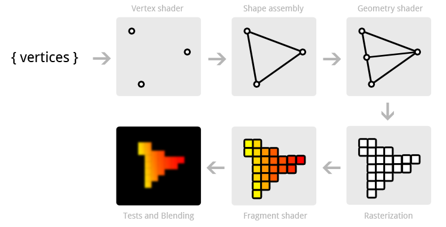

Programación de aplicaciones para dispositivos móviles
========================================================

Herramientas y fases de construcción.
------------------------------------------------------
La principal herramienta para programar aplicaciones Android es Eclipse aunque hoy en día está empezando a ser reemplazada por Android Studio.

En primer lugar se debe hacer un análisis de los permisos que deberá necesitar nuestra aplicación.

Todos los permisos que requiera nuestra aplicación se indican en el principal fichero del proyecto: ``AndroidManifest.xml``

El archivo ``AndroidManifest.xml`` es un archivo imprescindible en cualquier aplicación Android, debe tener siempre ese nombre y debe estar en el directorio raíz del proyecto. Este fichero sirve para lo siguiente:

* Identifica el paquete Java de la aplicación, que se usará como identificador único de la misma.

* Describe los componentes de la aplicación: actividades, servicios, etc...

* Determina qué procesos alojarán componentes de la aplicación.

* Declara los permisos que debe tener la aplicación para acceder al hardware o al software del sistema.

* Declara los permisos que otros componentes deben tener para interactuar con los componentes de nuestra aplicación.

* Identifica las clases ``Instrumentation`` que se usarán para monitorizar el rendimiento. Normalmente esto solo se hace mientras estamos en pruebas, después se elimina.

* Indica la versión mínima de Android que se necesita para ejecutar nuestra app.

* Indica las bibliotecas con las que enlaza nuestro programa.

Un ``AndroidManifest.xml`` tiene esta estructura:

.. code-block:: xml

	<?xml version="1.0" encoding="utf-8"?>

	<manifest>

		<uses-permission />
		<permission />
		<permission-tree />
		<permission-group />
		<instrumentation />
		<uses-sdk />
		<uses-configuration />  
		<uses-feature />  
		<supports-screens />  
		<compatible-screens />  
		<supports-gl-texture />  

		<application>

			<activity>
				<intent-filter>
					<action />
					<category />
					<data />
				</intent-filter>
				<meta-data />
			</activity>

			<activity-alias>
				<intent-filter> . . . </intent-filter>
				<meta-data />
			</activity-alias>

			<service>
				<intent-filter> . . . </intent-filter>
				<meta-data/>
			</service>

			<receiver>
				<intent-filter> . . . </intent-filter>
				<meta-data />
			</receiver>

			<provider>
				<grant-uri-permission />
				<meta-data />
				<path-permission />
			</provider>

			<uses-library />

		</application>

	</manifest>   
	
``<uses-permission>``	
------------------------------------------------------
Indica que la app necesita que se le conceda un cierto permiso para poder ser instalada y ejecutada. El permiso se indica en el atributo ``android:name`` con un valor como ``android.permission.CAMERA``.

También puede llevar un atributo ``android:maxSdkVersion`` con el que se indica la versión máxima de Android donde es necesario pedir el permiso. Se usa en los casos en los que un permiso deja de existir. Eclipse suele rellenar este valor con la misma versión que usamos para el desarrollo.

Un posible valor:

.. code-block:: xml

   <uses-permission
     android:name="android.permission.WRITE_EXTERNAL_STORAGE"
     android:maxSdkVersion="18" />

	 
	
	
Después de construir el ``AndroidManifest.xml``	se debería realizar un boceto de como va a ser el interfaz. Aunque se indique de esta forma, el ``AndroidManifest.xml`` puede volver a modificarse en el futuro. Hay aplicaciones que permiten elaborar el "wireframe" de nuestro interfaz, pero Eclipse también puede ayudar mucho en esta tarea.	
	
	

Interfaces de usuario. Clases asociadas.
------------------------------------------------------

Ejercicio
~~~~~~~~~~~~~~~~~~~~~~~~~~~~~~~~~~~~~~~~~~~~~~~~~~~~~~~~~~~~

Usando el diseñador de Eclipse construye un interfaz como el siguiente. Recuerda editar los ID de los controles (para poder tener en el código nombres más fáciles de recordar) y pon nuevos textos a los controles (para que la aplicación sea fácil de traducir)

.. figure:: imagenes/appPension.png
   :figwidth: 50%
   :align: center
   
   Interfaz de la aplicación
   
La aplicación calcula una pensión de una forma muy sencilla: si se ha cotizado durante el mínimo de años exigidos por la ley, se tiene una pensión equivalente al 90% del sueldo actual. Si no ha sido así se tiene una pensión del 75% del sueldo actual.

Aunque es una funcionalidad que todavía no se va a implementar, la app podrá enviar un SMS con el resultado (y un anuncio de nuestra empresa) a otro número. Esto implica hacer que la aplicación exija pedir ese permiso en el ``AndroidManifest.xml``.

Código Java
~~~~~~~~~~~~~~~~~~~~~~~~~~~~~~~~~~~~~~~~~~~~~~~~~~~~~~~~~~~~

El código Java sería algo así (faltan unas líneas)

.. code-block:: java

	public void calcularPension(View controlPulsado){
			EditText control;
			control=(EditText) 
					this.findViewById(R.id.txtSueldoActual);
			
			Editable cadPension=control.getEditableText();
			if (cadPension.toString().equals("")) return ;
			Double sueldoActual;
			sueldoActual=
					Double.parseDouble(cadPension.toString());
			
			ToggleButton togMinimo;
			togMinimo=(ToggleButton)
					this.findViewById(R.id.togMinimo);
			Double pensionResultado;
			if (togMinimo.isChecked()){
				pensionResultado=sueldoActual*0.9;
			}
			else {
				pensionResultado=sueldoActual*0.75;
			}
			
			EditText txtPensionResultado;
			txtPensionResultado=(EditText) 
					this.findViewById(R.id.txtPensionResultado);
			txtPensionResultado.setText(pensionResultado.toString());
		}
	
   

Sobre el diseño de interfaces
------------------------------------------------------

Cuando se diseña un interfaz lo normal es ir insertando los controles en "layouts" que a su vez van dentro de otros. El objetivo es poder modificar un bloque de controles sin afectar a los demás.

Todo control Android puede manipularse de dos formas:

* Indicando su tamaño en los parámetros ``width`` y ``height``. Se podría indicar el tamaño en puntos (mala idea porque el control no se redimensiona automáticamente) pero también se pueden indicar otras dos posibilidades:
	
	* ``wrap_content``: significa más o menos "adáptate al mínimo posible".
	* ``match_parent``: "agrándate y adáptate al tamaño de tu contenedor padre".

* Indicando qué proporción ocupa con respecto a sus controles del mismo contenedor. Esto se hace modificando el atributo ``weight`` y poniendo luego el ``width`` o el ``height`` a ``0dp``.

Ejercicio
~~~~~~~~~~~~~~~~~~~~~~~~~~~~~~~~~~~~~~~~~~~~~~~~~~~~~~~~~~~~

Crear una aplicación que permita al usuario practicar el cálculo mental con operaciones sencillas (sumas y restas) con números pequeños (de 1 a 99). Cuando el usuario introduce un resultado se le dice si acierta o no y se genera una nueva operación al azar.

.. code-block:: java

	package com.ies.calculus;

	import java.util.Random;

	import android.support.v7.app.ActionBarActivity;
	import android.os.Bundle;
	import android.util.Log;
	import android.view.Menu;
	import android.view.MenuItem;
	import android.view.View;
	import android.widget.EditText;
	import android.widget.TextView;

	public class ActividadPrincipal extends ActionBarActivity {
		int num1;
		int num2;
		String operacion;
		@Override
		protected void onCreate(Bundle savedInstanceState) {
			super.onCreate(savedInstanceState);
			setContentView(R.layout.activity_actividad_principal);
			generarOperacion();
		}
		

		@Override
		public boolean onCreateOptionsMenu(Menu menu) {
			// Inflate the menu; this adds items to the action bar if it is present.
			getMenuInflater().inflate(R.menu.actividad_principal, menu);
			return true;
		}

		@Override
		public boolean onOptionsItemSelected(MenuItem item) {
			// Handle action bar item clicks here. The action bar will
			// automatically handle clicks on the Home/Up button, so long
			// as you specify a parent activity in AndroidManifest.xml.
			int id = item.getItemId();
			if (id == R.id.action_settings) {
				return true;
			}
			return super.onOptionsItemSelected(item);
		}
		
		private void escribirNumeroEnTextView(
				int num, int id){
			TextView tv=(TextView)
					this.findViewById(id);
			tv.setText(""+num);
		}
		private void generarOperacion(){
			Random generador=new Random();
			num1=generador.nextInt(100);
			num2=generador.nextInt(100);
			escribirNumeroEnTextView(
					num1, R.id.tvOperando1);
			escribirNumeroEnTextView(
					num2, R.id.tvOperando2);
			//Para generar la op. matemática
			//escogeremos un valor al azar de un vector
			String[] ops={"+", "-"};
			
			int posAzar=generador.nextInt(ops.length);
			operacion=ops[posAzar];
			TextView tvOperando=
					(TextView)this.findViewById(R.id.tvOperador);
			tvOperando.setText(operacion);    	
		}
		public void comprobar(View control){
			EditText txtResultado=(EditText)
					this.findViewById(R.id.txtResultado);
			String resultado=txtResultado.getText().toString();
			TextView tvMensajes=(TextView)
					this.findViewById(R.id.tvMensajes);
			if (resultado.equals("")){
				tvMensajes.setText("Resultado incorrecto");
				generarOperacion();
				return ;
			}
			int resultCalculado=0;
			switch (operacion.charAt(0)){
				case '+':{
					resultCalculado=num1+num2;
					break;
				}
				case '-':{
					resultCalculado=num1-num2;
					break;
				}
			}
			int resultadoIntroducido=
					Integer.parseInt(resultado);
			if (resultadoIntroducido==resultCalculado){
				tvMensajes.setText("¡Correcto!");
			} else {
				tvMensajes.setText("¡MAL!");
			}
			txtResultado.setText("");
			generarOperacion();
		}
	}

Resumen de los contenedores Android
~~~~~~~~~~~~~~~~~~~~~~~~~~~~~~~~~~~~~~~~~~~~~~~~~~~~~~~~~~~~

En la imagen siguiente puede apreciarse la variedad de contenedores que ofrece Android:

   
   Contenedores Android
   
   
Actividades
------------------------------------------------------

Una actividad es un programa diseñado no solo para llamar a otros programas sino que también puede ofrecer sus servicios en Android para que otros programas les llamen a ellos.

El objetivo básico es comprender la forma de comunicar actividades en Android.

Actividad receptora de información
~~~~~~~~~~~~~~~~~~~~~~~~~~~~~~~~~~~~~~~~~~~~~~~~~~~~~~~~~~~~

Una actividad típica debería estar preparada para recibir parámetros de una forma similar a esta:

.. code-block:: java

	public static String parametroNombre=
			"com.ies.actividades1.nombrePersona";
	protected void onCreate(Bundle savedInstanceState) {
		super.onCreate(savedInstanceState);
		this.setContentView(R.layout.actividad_mostrar_nombres);
		
		Intent intentPasado=this.getIntent();
		String nombrePasado=
				intentPasado.getStringExtra(
			ActividadMostrarNombres.parametroNombre
		);
		
		TextView txtNombreAMostrar;
		txtNombreAMostrar=
				(TextView) this.findViewById(R.id.txtNombreMostrado);
		txtNombreAMostrar.setText(nombrePasado);
	}	

Actividad llamadora
~~~~~~~~~~~~~~~~~~~~~~~~~~~~~~~~~~~~~~~~~~~~~~~~~~~~~~~~~~~~

Una actividad que desee invocar a otro necesitará "pasar parámetros" de una forma similar a esta:

.. code-block:: java

	public void pasarNombre(View control){
    	EditText txtNombre;
    	txtNombre=(EditText) findViewById(R.id.txtNombre);
    	String nombre=txtNombre.getText().toString();
    	Intent iMostrarNombre;
    	//Indicamos quien es el llamador e
    	//indicamos
    	iMostrarNombre=new Intent(
    			this, ActividadMostrarNombres.class);
    	iMostrarNombre.putExtra
    		(ActividadMostrarNombres.parametroNombre
    				, nombre);
    	//Se lanza el intent
    	this.startActivity(iMostrarNombre);
    	
    }		

Construcción de actividades
------------------------------------------------------

Para crear una actividad desde cero necesitamos hacer dos cosas

1. Crear el interfaz XML (Eclipse puede que no añada un ``id`` a dicho interfaz, si no lo ha hecho añadirlo a mano)
2. Crear una clase Java que herede de ``Activity``. Dicha clase Java necesita que añadamos algo: el ``onCreate`` contendrá ahora el código que procesa el ``Intent`` que nos pasen y también  usaremos ``setContentView`` para cargar un fichero de interfaz o *layout*.
	
	
Dentro de la actividad suele ser buena política definir los nombres de los parámetros utilizando como prefijo el nombre del paquete:

.. code-block:: java

	public class 
		ActividadCalculadora extends Activity {

		public static String nombreNum1=
				"com.ies.actividades2.num1";
		public static String nombreNum2=
				"com.ies.actividades2.num2";
		public static String nombreOp=
				"com.ies.actividades2.op";
		@Override
		protected void onCreate(Bundle savedInstanceState) {
			// TODO Auto-generated method stub
			super.onCreate(savedInstanceState);
			
		}
	}

	
Ejemplo: llamadas entre actividades
------------------------------------------------------

Supongamos que deseamos tener una actividad que acepta recibir dos números y un operando. Tras la recepción se efectuará la operación matemática y se mostrará el resultado en un interfaz distinto de la actividad llamadora.

.. figure:: imagenes/actividadcalculadora.png
   :figwidth: 50%
   :align: center
   
   Aplicación con dos actividades

   
   

Actividad calculadora
~~~~~~~~~~~~~~~~~~~~~~~~~~~~~~~~~~~~~~~~~~~~~~~~~~~~~~~~~~~~

Esta actividad carga el interfaz XML y despues procesa el ``Intent`` para determinar qué operación debe ejecutar.

También define el nombre de los parámetros en **constantes** que tanto el llamador como ella pueden usar (y así evitar el cortar y pegar).

.. code-block:: java

	public class ActividadCalculadora extends Activity {

		public static String nombreNum1=
				"com.ies.actividades2.num1";
		public static String nombreNum2=
				"com.ies.actividades2.num2";
		public static String nombreOp=
				"com.ies.actividades2.op";
		@Override
		protected void onCreate(Bundle savedInstanceState) {
			// TODO Auto-generated method stub
			super.onCreate(savedInstanceState);
			this.setContentView(R.layout.actividad_secundaria);
			Intent intento=this.getIntent();
			float num1=
					intento.getFloatExtra(
							ActividadCalculadora.nombreNum1
							, 
							0.0f);
			float num2=intento.getFloatExtra(
					ActividadCalculadora.nombreNum2
					, 
					0.0f);
			String op=
					intento.getStringExtra(
							ActividadCalculadora.nombreOp);
			
			float resultado=this.calcular(num1, op, num2);
			
			String cadResultado=
					num1+op+num2+"="+resultado;	
			TextView tvResultado;
			tvResultado=(TextView) findViewById(R.id.tvResultado);
			tvResultado.setText(cadResultado);
		}
		public float calcular(float n1, String op, float n2){
			float resultado=0.0f;
			
			if (op.equals("+")){
				return n1+n2;
			}
			if (op.equals("-")){
				return n1-n2;
			}
			return resultado;
		}
	}	

Actividad llamadora
~~~~~~~~~~~~~~~~~~~~~~~~~~~~~~~~~~~~~~~~~~~~~~~~~~~~~~~~~~~~

.. code-block:: java

	public class ActividadPrincipal extends ActionBarActivity {

		@Override
		protected void onCreate(Bundle savedInstanceState) {
			super.onCreate(savedInstanceState);
			setContentView(R.layout.activity_actividad_principal);
		}

		@Override
		public boolean onCreateOptionsMenu(Menu menu) {
			// Inflate the menu; this adds items to the action bar if it is present.
			getMenuInflater().inflate(R.menu.actividad_principal, menu);
			return true;
		}

		@Override
		public boolean onOptionsItemSelected(MenuItem item) {
			// Handle action bar item clicks here. The action bar will
			// automatically handle clicks on the Home/Up button, so long
			// as you specify a parent activity in AndroidManifest.xml.
			int id = item.getItemId();
			if (id == R.id.action_settings) {
				return true;
			}
			return super.onOptionsItemSelected(item);
		}
		
		
		
		/* Dado un id de recurso este método nos
		 * devuelve el texto que hay dentro
		 */
		public float getNumero(int id){
			EditText control;
			control=(EditText) findViewById(id);
			String cadena=control.getText().toString();
			float f=Float.parseFloat(cadena);
			return f;
		}
		public void lanzarActCalculadora(
				float f1, float f2, String op
				){
			Intent intento=new Intent(this, ActividadCalculadora.class);
			intento.putExtra(
					ActividadCalculadora.nombreNum1,
					f1);
			intento.putExtra(
					ActividadCalculadora.nombreNum2,
					f2);
			intento.putExtra(
					ActividadCalculadora.nombreOp,
					op);
			this.startActivity(intento);
		}
		public void calcular(View control){
			RadioButton rbSuma;
			rbSuma=(RadioButton) findViewById(R.id.radSuma);
			if (rbSuma.isChecked()){
				float f1=this.getNumero(R.id.txtNum1);
				float f2=this.getNumero(R.id.txtNum2);
				lanzarActCalculadora(f1,f2,"+");
			}
		}   
	}
	
Modificación del ``AndroidManifest.xml``	
~~~~~~~~~~~~~~~~~~~~~~~~~~~~~~~~~~~~~~~~~~~~~~~~~~~~~~~~~~~~

Se debe añadir esta actividad en el ``AndroidManifest.xml``

.. code-block:: xml

		<activity 
			android:name=".ActividadCalculadora">        
        </activity>

		
Ejercicio
------------------------------------------------------

Crear una aplicación con dos actividades donde una de ellas permita introducir un texto y un número y la otra reciba ambos valores. La segunda truncará los *n* primeros caracteres de la cadena y los mostrará en pantalla.

.. figure:: imagenes/acttruncado.png
   :figwidth: 50%
   :align: center
   
   Ejemplo de funcionamiento del truncado
   
Actividad inicial
~~~~~~~~~~~~~~~~~~~~~~~~~~~~~~~~~~~~~~~~~~~~~~~~~~~~~~~~~~~~

.. code-block:: java

	public class ActPeticionTexto extends ActionBarActivity {

		@Override
		protected void onCreate(Bundle savedInstanceState) {
			super.onCreate(savedInstanceState);
			setContentView(R.layout.activity_act_peticion_texto);
		}

		@Override
		public boolean onCreateOptionsMenu(Menu menu) {
			// Inflate the menu; this adds items to the action bar if it is present.
			getMenuInflater().inflate(R.menu.act_peticion_texto, menu);
			return true;
		}

		@Override
		public boolean onOptionsItemSelected(MenuItem item) {
			// Handle action bar item clicks here. The action bar will
			// automatically handle clicks on the Home/Up button, so long
			// as you specify a parent activity in AndroidManifest.xml.
			int id = item.getItemId();
			if (id == R.id.action_settings) {
				return true;
			}
			return super.onOptionsItemSelected(item);
		}
		private String getCadena(int id){
			EditText controlTexto=
					(EditText) this.findViewById(id);
			return controlTexto.getText().toString();
		}
		
		public void truncar(View control){
			Intent intento=new Intent(this,ActividadTruncadora.class);
			String textoEscrito=
					getCadena(R.id.txtTexto);
			String textoNumCaracteres=
					getCadena(R.id.txtNumero);
			int numCaracteres=Integer.parseInt(
					textoNumCaracteres);
			intento.putExtra(
					ActividadTruncadora.nombreCadena, 
					textoEscrito);
			intento.putExtra(
					ActividadTruncadora.nombreNumCaracteres, 
					numCaracteres);
			this.startActivity(intento);
		}
	}
	

Actividad truncadora
~~~~~~~~~~~~~~~~~~~~~~~~~~~~~~~~~~~~~~~~~~~~~~~~~~~~~~~~~~~~

.. code-block:: java

	public class ActividadTruncadora extends Activity {
		public static String nombreCadena=
				"com.ies.truncado.nombreCadena";
		public static String nombreNumCaracteres=
				"com.ies.truncado.nombreNumCaracteres";
		@Override
		protected void onCreate(Bundle savedInstanceState) {
			// TODO Auto-generated method stub
			super.onCreate(savedInstanceState);
			this.setContentView(R.layout.act_truncado);
			Intent intRecibido=this.getIntent();
			String cad=intRecibido.getStringExtra(
					ActividadTruncadora.nombreCadena
					);
			int numCaracteres=	intRecibido.getIntExtra(
				ActividadTruncadora.nombreNumCaracteres,
				0);
			
			String cadTruncada=this.truncar(cad, numCaracteres);
			Log.d("Truncado", "Resultado:"+cadTruncada);
			TextView tvTextoTruncado=
					(TextView) this.findViewById(R.id.tvResultado);
			tvTextoTruncado.setText(cadTruncada);
		}
		
		/* Recorta los num primeros caracteres*/
		private String truncar (String cad, int num){
			/* Si el usuario intenta poner
			 * un valor más grande que la propia
			 * longitud de la cadena, reducimos el numero
			 */
			if (num>cad.length()){
				num=cad.length();
			}
			return cad.substring(0, num);	
		}
	}
	
Ejercicio 
------------------------------------------------------

Crear una aplicación que permita simular un juego de apuestas a la ruleta.

El usuario puede apostar de 1 a 100 euros y parte con un saldo inicial ficticio de 1000 euros.

La ruleta tiene 37 números (del uno al 36 más el 0, que será un caso especial) y el usuario puede apostar de dos formas:

* Puede apostar a par o impar: si apuesta por ejemplo 2 euros a "Par" y sale por ejemplo, el 18, ganará un 50% más, es decir los dos euros se multiplican por 0'5 y ganará un euro. Si pierde, pierde los dos euros.

* Puede apostar a que el número está en la primera docena (del 1 al 12) en la segunda docena (del 13 al 24) o en la tercera docena (del 25 al 36). Si por ejemplo apostamos 3 euros a la primera docena y sale por ejemplo el 7 multiplicamos por 0,66 los 3 euros y obtendremos 2 euros de beneficio. Si perdemos perdemos los 3 euros que apostamos.

* El 0 significa que la banca gana. No  importa si la apuesta se hizo a "Par" o a "Primera docena". Perderemos todo lo que apostamos.

		
Bases de datos y almacenamiento.
------------------------------------------------------

Android ofrece 5 posibilidades a la hora de almacenar datos:

* Preferencias.
* Almacenamiento interno.
* Almacenamiento externo.
* Bases de datos SQLite.
* Almacenamiento en la nube.

Preferencias compartidas
~~~~~~~~~~~~~~~~~~~~~~~~~~~~~~~~~~~~~~~~~~~~~~~~~~~~~~~~~~~~

Dentro de las preferencias se puede almacenar cualquier tipo de datos básicos: ``String``, ``int``, ``floats``, ``ints`` y ``longs``. Dentro de nuestra actividad podemos usar dos tipos de preferencias

* Preferencias compartidas: lo usaremos cuando queramos manejar muchos ficheros de preferencias, debiendo indicar siempre un nombre de fichero.
* Preferencias únicas. Si solo queremos un fichero de preferencias para la actividad no tendremos que indicar ningún nombre de fichero.

Para escribir valores usaremos el objeto ``SharedPreferences`` de esta forma

.. code-block:: java

    public class Actividad1 extends Activity{
        private static String ficheroPrefs="misPrefs.prf";
        private MODO_FICHERO=MODE_PRIVATE
        protected void onCreate(Bundle estado){
            SharedPreferences prefs=getSharedPrefs(
                    ficheroPrefs, MODO_FICHERO);
            SharedPreferences.Editor editor=
                    prefs.edit();
            editor.putString("nombreUsuario", "pepe");
            /* ¡NO HAY QUE OLVIDAR EL COMMIT!*/
            editor.commit();
        }

Un fichero se puede crear de varias maneras:

* ``MODE_PRIVATE``
* ``MODE_WORLD_READABLE``
* ``MODE_WORLD_WRITABLE``
* ``MODE_MULTI_PROCESS``: Lo usaremos cuando queramos indicar que muchos ficheros van a cambiar a la vez el fichero en forma ``MODE_PRIVATE | MODE_MULTI_PROCESS``.

Por ejemplo, supongamos una aplicación que desea guardar un texto como el nombre de usuario que está almacenado en un control ``EditText``. El código para almacenar sería algo así:

.. code-block:: java

	String ficheroPrefs="nombre_usuario";
	String claveUltimoUsuario="ultimo_usuario";
	
	public void guardar(View control){
    	EditText txtNombre=
    			(EditText) findViewById(R.id.txtNombre);
    	String cadena=
    			txtNombre.getText().toString();
    	SharedPreferences gestorPrefs;
    	
    	
    	gestorPrefs=this.getSharedPreferences(
    			ficheroPrefs, MODE_PRIVATE);
    	
    	SharedPreferences.Editor editor;
    	editor=gestorPrefs.edit();
    	
    	editor.putString(claveUltimoUsuario, 
    			cadena);
    	
    	/* Si no hay commit, no se cierra
    	 * la transacción->No se almacenará
    	 */
    	editor.commit();
    	Log.d("Almacen:", "Cadena almacenada");
    }
    
Almacenamiento interno
~~~~~~~~~~~~~~~~~~~~~~~~~~~~~~~~~~~~~~~~~~~~~~~~~~~~~~~~~~~~

Los ficheros creados aquí son privados a nuestra aplicación. Ni siquiera el usuario puede acceder a ellos (salvo en caso de teléfonos *rooteados* )

Para almacenar haremos algo como esto:

.. code-block:: java

    String fichero  =   "saludo.txt";
    String mensaje  =   "Hola mundo";
    FileOutputStream fos=openFileOutput(fichero, MODE_PRIVATE);
    fos.write(mensaje.getBytes());
    fos.close();
    
Almacenamiento externo
~~~~~~~~~~~~~~~~~~~~~~~~~~~~~~~~~~~~~~~~~~~~~~~~~~~~~~~~~~~~

Implica solicitar permisos como ``READ_EXTERNAL_STORAGE`` o ``WRITE_EXTERNAL_STORAGE``.

El almacenamiento puede estar o no disponible, se debería comprobar con algo como:

.. code-block:: java

	String estado =
		Environment.getExternalStorageState();
	if (Environment.MEDIA_MOUNTED.equals(state)) {
		/* Podemos escribir y además leer*/
		return SE_PUEDE_ESCRIBIR;
	}
	if (Environment.MEDIA_MOUNTED.equals(estado) ||
	Environment.MEDIA_MOUNTED_READ_ONLY.equals(state)) {
		return SOLO_SE_PUEDE_LEER;
	}
	/* Si llegamos aquí no se puede hacer nada*/
	return NO_SE_PUEDE_HACER_NADA;
	
Como vemos, la clave está en la clase ``Environment`` que nos ofrece diversos métodos y constantes para acceder a directorios de la tarjeta.

.. figure:: imagenes/directorios.png
   :figwidth: 50%
   :align: center
   
   Directorios estándar
   
Por ejemplo, el código siguiente ilustra como conseguir crear un subdirectorio en el directorio estándar de imágenes:

.. code-block:: java

	String miDir="mis_imgs";
	File file = 
		new File ( 
		Environment.getExternalStoragePublicDirector
			(Environment.DIRECTORY_PICTURES), 
			miDir
	);
	if (!file.mkdirs()) {
        Log.e("Error", "No se pudo crear "+miDir);
	}

   
Ejercicio
------------------------------------------------------

En los juegos de apuestas, todo jugador siempre desea saber el punto en el que debió dar marcha atrás, sin embargo, no siempre es fácil recordar cual fue.

Para facilitar esto se desea modificar el programa de simulación de la ruleta para que se vaya almacenando todo el historial de apuestas en un fichero llamado ``historial.txt``.

En dicho historial deberíamos ir viendo el saldo, el tipo de apuesta que hizo el usuario (si fue a par, si fue a la segunda docena...), el número que salió al apostar y el estado en que quedó el saldo. Estas operaciones deben almacenarse cada vez que el usuario hace una apuesta del tipo que sea.

Bases de datos
------------------------------------------------------

En Android es perfectamente posible utilizar bases de datos relacionales con prácticamente todas sus características: tablas, claves primarias y ajenas, consultas, etc... El corazón de este sistema es `SQLite <http://sqlite.org>` un gestor de bases de datos pensado para dispositivos reducidos y con versiones para prácticamente todas las plataformas.

Para operar con bases de datos la documentación oficial de Google aconseja utilizar *clases contrato*. En dichas clases se almacenarán los nombres de las tablas, campos y demás, con el fin de facilitar el mantenimiento. Aunque no es obligatorio es muy aconsejable implementar el interfaz ``BaseColumns``. De hecho hay muchos casos en los que Android espera clases que implementen dicho interfaz.

Supongamos que deseamos almacenar información técnica sobre modelos de automóvil y los costes asociados de un seguro: supongamos que hay coches de muchas marcas y modelos, y que para cada uno de ellos se puede contratar un seguro de uno de estos tipos (aunque se desea poder tener más tipos de seguro en el futuro):

* Seguro obligatorio.
* Seguro lunas+incendio sin franquicia.
* Seguro lunas+incendio con franquicia.
* Seguro todo riesgo.

No todos los seguros se ofrecen para todos los coches y de hecho podría haber coches para los cuales la compañía no ofrece ningún seguro. No todos los tipos de seguro tienen el mismo coste para todos los coches. Todo seguro tiene una validez medida en días y siempre es la misma para un cierto tipo de seguro. Por ejemplo, todos los seguros obligatorios tienen una validez de 365 días y todos los "todo riesgo" de 90. Los seguros del tipo "lunas+incendio" tienen todos una validez de 180 días.

Toda marca tiene un nombre y un código único, todo modelo tiene un nombre único y una cilindrada. Todo seguro tiene un un código único y una descripción.

   
   
Con esto el SQL que necesitaríamos por ejemplo para la tabla ``Marcas`` sería algo así:

.. code-block:: sql

    create table marcas
    (
        id integer primary key,
        nombre varchar(40)
    );
    
    insert into marca values (1, "Ford");
    insert into marca values (2, "Renault");

Y la clase contrato Java asociada a esta entidad sería:

.. code-block:: java

    public class MarcasContrato implements BaseColumns {
            public static final String 
                    NOMBRE_TABLA="marcas";
            public static final String 
                    NOMBRE_COL_ID="id";
            public static final String 
                    NOMBRE_COL_NOMBRE="nombre";
    }
    
    
    
Bases de datos SQLite
~~~~~~~~~~~~~~~~~~~~~~~~~~~~~~~~~~~~~~~~~~~~~~~~~~~~~~~~~~~~

Supongamos que deseamos crear una base de datos sobre seguros de coches. Un primer elemento necesario sería una tabla donde se almacenen las marcas (cada una llevará un ID).

.. code-block:: sql

	create table marcas (
		id	integer primary key,
		marca	char(30)
	);
	
	insert into marcas values (1, 'Ford');
	insert into marcas values (2, 'Renault');

Para manejar la creación y procesado de esta base de datos Android ofrece la clase ``SQLiteOpenHelper`` de la cual se puede heredar de esta manera:

.. code-block:: java

    public class BD extends SQLiteOpenHelper {
    
            private String sqlCreacion=
                "create table marcas(id integer primary key," + 
                    "nombre varchar(40));\n" ;
            private String insert1="insert into marca values (1, \"Ford\")";
            private String insert2="insert into marca values (2, \"Renault\");";
            public BD(Context context, String name,
                CursorFactory factory, int version) {
                    super(context, name, factory, version);
            }
    
            @Override
            public void onCreate(SQLiteDatabase db) {
                    db.execSQL(sqlCreacion);
                    db.execSQL(insert1);
                    db.execSQL(insert2);
    
            }
    }

Y podemos crear un objeto de la clase BD simplemente instanciándolo

.. WARNING::

   Cuando se hacen pruebas en el simulador es posible que el fichero de base de datos no aparezca hasta que no   intentemos leer o escribir datos de él. Aparte de eso, el fichero suele estar en el directorio ``/data/data/<paquete>`` *pero las ubicaciones pueden cambiar*.

Datos y cursores
~~~~~~~~~~~~~~~~~~~~~~~~~~~~~~~~~~~~~~~~~~~~~~~~~~~~~~~~~~~~

Un objeto del tipo ``SQLiteOpenHelper`` nos puede devolver un objeto ``SQLiteDatabase`` que tiene los métodos necesarios para acceder a cursores, hacer consultas y recorrer los datos. El código siguiente muestra un ejemplo:

.. code-block:: java

    BD gestorBD=new BD(this, "seguros.db", null, 1);
    SQLiteDatabase bd=gestorBD.getReadableDatabase();
    Cursor cursor=bd.rawQuery("select id, nombre from marcas", null);
    cursor.moveToFirst();
    int posID=cursor.getColumnIndex(MarcasContrato.NOMBRE_COL_ID);
    int posNombreMarca=
        cursor.getColumnIndex(MarcasContrato.NOMBRE_COL_NOMBRE);
    while (!cursor.isAfterLast()){
        String numero=cursor.getString(posID);
        String marca=cursor.getString(posNombreMarca);
        Log.d("Marca:", numero+":"+marca);
        cursor.moveToNext();
    }
    cursor.close();
    
	
Ejercicio: ampliación de la BD
------------------------------------------------------
Ampliar la base de datos para que exista una tabla "Modelos" que incluya un par de modelos de cada marca (tiene que haber claves ajenas).

* Marca: Ford, Modelo: Focus
* Marca: Ford, Modelo: Mondeo
* Marca: Renault, Modelo: Megane
* Marca: Renault, Modelo: Kangoo

Hacer un programa que recupere todos los modelos de coche junto con sus marcas y los muestre en pantalla.

Solución a la ampliación de la BD
------------------------------------------------------

En primer lugar, habría que crear el SQL que permita tener la segunda tabla con la clave ajena:

.. code-block:: sql

    create table marcas
    (
        id integer primary key,
        nombre varchar(40)
    );
    
    insert into marcas values (1, "Ford");
    insert into marcas values (2, "Renault");
    
    create table modelos
    (
        id_modelo integer primary key,
        id_marca integer, 
        nombre varchar(40),
        foreign key (id_marca) references marcas (id)
    );
    insert into modelos values(1, 1, 'Focus');
    insert into modelos values(2, 1, 'Mondeo');
    insert into modelos values(3, 2, 'Megane');
    insert into modelos values(4, 2, 'Kangoo');
    
En lugar de insertar todo el código SQL **se puede crear el archivo de base de datos en un ordenador** e insertarlo en el proyecto despues, por desgracia Android no ofrece un soporte cómodo para hacer esto, ya que una vez instalada la app tenemos que copiar el fichero de base de datos al terminal para despues abrirlo.

Creación dinámica del interfaz
~~~~~~~~~~~~~~~~~~~~~~~~~~~~~~~~~~~~~~~~~~~~~~~~~~~~~~~~~~~~
Un problema fundamental en este ejercicio es que no sabemos a priori cuantos controles poner en la aplicación: **el interfaz se tiene que crear dinámicamente**

Supongamos que simplemente deseamos crear un ListView en el que se muestren simplemente los modelos de coche. Se pueden utilizar un par de clases útiles para conseguir lo que queramos de la forma siguiente:

* Metemos los nombres en un vector de Strings.
* Crearemos un fichero de layout para indicar como se mostrará cada modelo. Este layout debe tener un TextView (Android encontrará automáticamente el TextView y en él insertará cada nombre de modelo).
* Usamos la clase ``ArrayAdapter``, que "convierte" cada elemento de nuestro *array* en un elemento del ListView. Le indicaremos el fichero de layout que debe crearse *para cada modelo individual*.
* Indicamos al ListView que use ese ``ArrayAdapter``.

Para conseguir que la clase BD nos devuelve un vector de Strings le podemos añadir el siguiente método:

.. code-block:: java

    public String[] getArrayModelos(){
    	String[] vectorResultado;
    	SQLiteDatabase bd=this.getReadableDatabase();
        Cursor cursor=bd.rawQuery("select nombre from modelos", null);
        vectorResultado=new String[cursor.getCount()];
        cursor.moveToFirst();
        int pos=0;
        while (!cursor.isAfterLast()){
        	vectorResultado[pos]=cursor.getString(0);
        	Log.d("D",  cursor.getString(0));
        	cursor.moveToNext();
        	pos++;
        }
    	return vectorResultado;
    }
    
Y para que ahora la Actividad cree el interfaz dinámicamente podemos hacer algo como esto:

.. code-block:: java

    protected void onCreate(Bundle savedInstanceState) {
        super.onCreate(savedInstanceState);
        setContentView(R.layout.activity_actividad_principal);
        
        /* Recuperamos los modelos*/
        String[] modelosCoche=gestorBD.getArrayModelos();
        /* Cada modelo de coche se insertará en el fichero
         * de layout que tiene un textview donde
         * se pondrá el nombre del modelo */
        ArrayAdapter<String> adaptador=
        		new ArrayAdapter(this, 
        				R.layout.modelo, R.id.tvNombreModelo, 
        				modelosCoche);
        /* El Listview de nuestro interfaz cargará
         * los datos a partir de ese adaptador */
        ListView lvModelos=(ListView) this.findViewById(R.id.lvModelos);
        lvModelos.setAdapter(adaptador);
    }    

Respondiendo al evento click
~~~~~~~~~~~~~~~~~~~~~~~~~~~~~~~~~~~~~~~~~~~~~~~~~~~~~~~~~~~~

Un problema que ocurre es que aunque alguien haga click en algún modelo no ocurre nada. Para conseguir que la actividad procese el evento podemos hacer que la actividad implemente el interfaz ``AdapterView.OnItemClickListener``.

.. WARNING::

   Al hacer esto debemos asegurarnos de poner a ``false`` el atributo ``Focusable`` de los controles. En concreto deberemos ir al fichero de layout que sirve de plantilla para cada control y si por ejemplo hay un ``EditText`` (que podría apoderarse del evento click) modificar su ``Focusable`` como hemos dicho. Se debe hacer esto para todos los controles.

.. code-block:: java

    protected void onCreate(Bundle savedInstanceState) {
        super.onCreate(savedInstanceState);
        setContentView(R.layout.activity_actividad_principal);
        
        /* Recuperamos los modelos*/
        String[] modelosCoche=gestorBD.getArrayModelos();
        /* Cada modelo de coche se insertará en el fichero
         * de layout que tiene un textview donde
         * se pondrá el nombre del modelo */
        ArrayAdapter<String> adaptador=
        		new ArrayAdapter(this, 
        				R.layout.modelo, R.id.tvNombreModelo, 
        				modelosCoche);
        /* El Listview de nuestro interfaz cargará
         * los datos a partir de ese adaptador */
        ListView lvModelos=(ListView) this.findViewById(R.id.lvModelos);
        lvModelos.setAdapter(adaptador);
        /* Activar la gestión de eventos*/
        lvModelos.setOnItemClickListener(this);
    }
    public void onItemClick(AdapterView<?> padre, View control, int posicion,
			long id) {
	Toast.makeText(this, "Click en "+posicion, Toast.LENGTH_SHORT).show();		
    }

Esto se muestra en el emulador de esta forma

.. figure:: imagenes/ListViewDinamico.png
   :figwidth: 50%  
   :align: center
   :alt: Contenedores Android
   

Creación dinámica de controles avanzada
~~~~~~~~~~~~~~~~~~~~~~~~~~~~~~~~~~~~~~~~~~~~~~~~~~~~~~~~~~~~

El ``ArrayAdapter`` es útil pero solo sirve cuando manejamos cadenas, lo cual es un dato simple. Sin embargo, si queremos representar algo más complejo (por ejemplo, el nombre de modelo y el código de modelo) se necesita una clase más avanzada, que además pueda recuperar datos directamente de un ``Cursor``: la clase ``SimpleCursorAdapter``

Esta clase espera que pasemos cuatro cosas:
* La clase padre: normalmente ``this``
* Un vector con los nombres de las columnas que vamos a extraer de la consulta.
* Un vector con los ``id`` de recursos de controles donde se va a meter el valor de cada columna.
* Flags que puedan modificar el comportamiento de la clase (normalmente usaremos 0).

El problema principal es que esta clase **espera que nuestro cursor tenga algún campo llamado _id** que actúe como identificador así que tendremos que reescribir nuestro SQL y pasarlo de esto
.. code-block:: sql

    select id_modelo, nombre from modelos
    
a esto

.. code-block:: sql

    select id_modelo as _id, nombre from modelos

Así que ahora un método que podría rellenar controles dinámicamente sería este:

.. code-block:: java

    public void rellenarControles(){
    	SQLiteDatabase bd=gestorBD.getReadableDatabase();
    	Cursor cursor=bd.rawQuery("select id_modelo as _id, nombre from modelos",null);
    	String[] nombresColumnas={
    			BaseColumns._ID, 
    			ModelosContrato.NOMBRE_COL_NOMBRE
    	};
    	int[] idTextViews={
    			R.id.tvIdModelo, 
    			R.id.tvModelo
    	};
    	SimpleCursorAdapter adaptador=
    			new SimpleCursorAdapter(this, 
    					R.layout.modelos_avanzados,cursor,
    					nombresColumnas, idTextViews,0);
    	ListView lvModelos=(ListView) this.findViewById(R.id.lvModelos);
        lvModelos.setAdapter(adaptador);
        lvModelos.setOnItemClickListener(this);
    }
    
    
.. WARNING::

   El código para cargar datos o crear controles puede ser lento y podría llegar a bloquear el interfaz. Es recomendable delegar todo el código que pueda ser lento a una ``AsyncTask``

Servicios en dispositivos móviles.
------------------------------------------------------
Proveedores de contenido.
------------------------------------------------------

Para poder echar un vistazo a un proveedor de contenidos muy utilizado, el de los contactos necesitaremos crear algunos contactos de prueba. Para leer desde proveedores de contenidos puede ser necesario activar permisos en el ``AndroidManifest.xml``. Por ejemplo, para poder leer contactos es necesario el permiso ``READ_CONTACTS``

Fundamentos
~~~~~~~~~~~~~~~~~~~~~~~~~~~~~~~~~~~~~~~~~~~~~~~~~~~~~~~~~~~~

Un proveedor de contenidos es una clase Java que permite acceder a datos **como si esos datos estuvieran en una tabla** (aunque no estén). Para acceder a estos datos *se necesita la URI correcta* que habrá que buscar en la documentación.

Una URI es más o menos como una tabla. Se podrán acceder a sus datos haciendo "consultas", cuyos resultados podremos recorrer con un cursos y extraer los campos que deseemos.

Un ejemplo
~~~~~~~~~~~~~~~~~~~~~~~~~~~~~~~~~~~~~~~~~~~~~~~~~~~~~~~~~~~~

La siguiente clase accede a diversa información de contactos. La URI de contactos es algo como "content://com.android.contacts/data".

Sin embargo, poner las URI directamente como un String es muy arriesgado, ya que la URI puede cambiar. Para evitar esto Android ofrece clases con constantes que permiten que nuestro código acceda a URIs sin que tengamos que preocuparnos por problemas futuros debidos a cambios en la URI. En Android la URI para los contactos es ``ContactsContract.Data.CONTENT_URI``.

Esta "tabla" tiene diversos campos, que podemos extraer mediante sus "nombres de contrato", es decir constantes que nos protegen contra posibles cambios de nombre de campo que pueda haber en el futuro.

Un problema que ocurre a menudo es que la estructura de los proveedores de contenido puede ser muy extraña. Por ejemplo, a nivel interno, Android ofrece en esta tabla de datos filas para cada trozo de información de un contacto. Es decir, si hay un contacto llamado "Pepe Perez" con teléfono "555-123456", **veremos dos filas**, una para cada trozo.

Al recorrer la tabla de datos podemos examinar la columna MIMETYPE, que nos dirá lo que hay almacenado en DATA1, la columna que contiene la información relevante. En realidad hay alias que ofrecen nombres más significativos que DATA1, pero aún así no se debe olvidar consultar el MIMETYPE.

El ejemplo siguiente extrae todos los "trozos de datos" y nos muestra solo los email.

.. code-block:: java

	public class GestorContactos {
		Uri uriContactos;
		public GestorContactos(ContentResolver cr){
			uriContactos=
					ContactsContract.Data.CONTENT_URI;
			Log.d("DEBUG", "Gestor contactos construido");
			Log.d("DEBUG", "La URI es:"+
					uriContactos.toString());
			
			String[] campos={
				ContactsContract.Data.DISPLAY_NAME	
			};
			Cursor cursor=
					cr.query(uriContactos, campos,
							null, null, null);
			int numDatos=cursor.getCount();
			Log.d("DEBUG", "Num datos:"
					+numDatos);
			cursor.moveToFirst();
			while (!cursor.isAfterLast()){
				int posData1=
						cursor.getColumnIndex(
								ContactsContract.Data.DATA1);
				int posTipo=
						cursor.getColumnIndex(
								ContactsContract.Data.MIMETYPE
								);
				String tipo=
						cursor.getString(posTipo);
				if (
					tipo.equals(ContactsContract.CommonDataKinds.Email.CONTENT_ITEM_TYPE))
				{
					String data1=cursor.getString(posData1);
					Log.d("DEBUG", 
							"El data 1/email:"+data1);
				}
				cursor.moveToNext();
			}
		}
	}

Otra forma de acceder a la información es la siguiente:

Ejercicio: proveedor de diccionario
------------------------------------------------------

Sabiendo que Android ofrece un proveedor para el diccionario del usuario, añadir algunas palabras a dicho diccionario.

	
Solución al diccionario
~~~~~~~~~~~~~~~~~~~~~~~~~~~~~~~~~~~~~~~~~~~~~~~~~~~~~~~~~~~~

En realidad la clase ``UserDictionary.Words`` ofrece un método ``addWord`` que resuelve esta tarea. Sin embargo, probaremos a hacerlo manejando directamente el proveedor de contenidos. En concreto, para poder insertar valores se tiene que hacer uso de otra clase llamada ``ContentValues``, dentro de la cual se pondrá la información que se desea almacenar en el proveedor.

La clase ``UserDictionary.Words`` requiere pasar lo siguiente:

* La palabra a incluir en el diccionario.
* La frecuencia con la que pensamos que aparece, siendo 1 el valor "muy poco probable que aparezca" y el 255 el "aparece con mucha frecuencia".
* A partir de la versión 16 de Android el programador puede, si lo desea, pasar un "atajo" es decir, una abreviatura que Android luego puede expandir automáticamente.

El código siguiente ilustra como insertar un valor:

.. code-block:: java

    public class GestorDiccionario {
            ContentResolver cr;
            Uri uriDiccionario;
            public GestorDiccionario(ContentResolver cr){
                    this.cr=cr;
                    uriDiccionario=android.provider.UserDictionary.Words.CONTENT_URI;
                    Log.d("DEBUG", "La URI es:"+uriDiccionario.toString());
            }
            public void insertarPalabra(String palabra, String atajo){
                    /* Este objeto "empaqueta" los valores que queremoa
                     * insertar en una URI
                     */
                    ContentValues objetoValores=new ContentValues();
                    /* La frecuencia puede ir de 1 a 255 (siendo el 255 "muy frecuente"
                     * En principio suponemos que nuestra palabra es poco frecuente
                     */
                    objetoValores.put(UserDictionary.Words.FREQUENCY, 1);
                    objetoValores.put(UserDictionary.Words.WORD, palabra);
                    /* Los atajos solo se pueden insertar a partir
                     * de la version 16 de Android
                     */
                    if (Build.VERSION.SDK_INT>=16)
                    {
                            objetoValores.put(UserDictionary.Words.SHORTCUT, atajo);
                    }
                    cr.insert(uriDiccionario, objetoValores);	
            }	
    }    
 
Gestión de recursos y notificaciones.
------------------------------------------------------

Técnicas de animación y sonido.
------------------------------------------------------
A partir de su versión 3 (API 11) Android ofrece una enorme variedad de posibilidades para animar elementos. Aunque se puede hacer desde código, el método recomendado es usar XML. Una animación definida en XML puede aplicarse a cualquier elemento.

Una animación puede ser de tres tipos:

1. Animación de un valor: elemento ``<animator>``
2. Animación de un objeto: elemento ``<objectAnimator>``
3. Agrupamiento de animaciones de valor o de objeto: elemento ``<set>``

La animación de un valor es tan simple como esto en Java:

.. code-block:: java

    ValueAnimator animacion = ValueAnimator.ofInt(100,200)
    animation.setDuration(1000);
    animation.start();
    
O en XML:

.. code-block:: xml

    <animator android:valueFrom="100"
        android:valueTo="200"
        android:duration="1000">
    </animator>

Las animaciones XML se almacenarán en el directorio ``res/animator/<nombre_archivo>.xml``. Un problema es que la animación de un valor no hace nada: **hay que implementar listeners**. Si nuestra clase implementa el interfaz ``ValueAnimator.AnimatorUpdateListener`` y de él implementa el método ``onAnimationUpdate(ValueAnimator animacion)``, este método se ejecutará automáticamente cada vez que toque "mostrar un nuevo cuadro de animación". Este problema se resuelve con los ``ObjectAnimator``

Ejercicio: contador
~~~~~~~~~~~~~~~~~~~~~~~~~~~~~~~~~~~~~~~~~~~~~~~~~~~~~~~~~~~~

Implementa un programa que tenga un boton y un cuadro de texto con un número. Cuando el usuario haga click en el botón el contador irá de 0 a 100. Usa animaciones de valores con XML.

La solución pasa por dar los siguientes pasos:

1. Crear el XML que defina la animación.
2. En algún punto del código "inflarla" (crear un objeto a partir del XML) e indicar un objeto que reciba las actualizaciones en la animación (un objeto que implemente el interfaz ``AnimatorUpdateListener``.
3. Indicar en una clase el ``implements AnimatorUpdateListener``
4. Implementar el método ``onAnimationUpdate``.

Fabriquemos el XML

.. code-block:: xml

	<?xml version="1.0" encoding="utf-8"?>
	<animator 
		xmlns:android="http://schemas.android.com/apk/res/android" 
		android:valueFrom="0"
		android:valueTo="100"
		android:valueType="intType"
		android:duration="1500"
		> 
	</animator>
   
La animación se "infla" así:

.. code-block:: java

	public void animarNumero(View control){
		Toast mensaje=Toast.makeText(this, 
				"Boton pulsado", Toast.LENGTH_SHORT);
		mensaje.show();
		if (Build.VERSION.SDK_INT>=11){
			ValueAnimator animador=
				(ValueAnimator) 
					AnimatorInflater.loadAnimator
						(
						this, R.animator.animador_contador
					);
		animador.addUpdateListener(this);
		animador.start();
	}	

Al comienzo de nuestra clase pondremos 
.. code-block:: java

	implements AnimatorUpdateListener
	
E implementaremos el método siguiente:

.. code-block:: java

	public void onAnimationUpdate(
			ValueAnimator animador) {
		Integer valorActual=(Integer) 
				animador.getAnimatedValue();
		txtNumero.setText(
			valorActual.toString()
		);		
	}

Imagenes y fotos
------------------------------------------------------

En primer lugar, para usar la cámara deberemos añadir esto al ``AndroidManifest.xml``. Si estamos probando nuestros programas con un emulador también debemos asegurarnos de que el emulador tiene una, aunque sea emulada. También es posible que el emulador exija disponer de una tarjeta SD, por lo que pondremos una (y también daremos el permiso ``WRITE_EXTERNAL_STORAGE``). El código para el ``AndroidManifest.xml`` es este.

.. code-block:: xml

    <uses-feature android:name="android.hardware.camera"
                  android:required="true" />
    <uses-sdk...

Esto hará que la aplicación solo se pueda utilizar en dispositivos que tengan cámara (la mayoría). Dado que Android permite "reutilizar" trabajo mediante los ``Intent`` lo que haremos será lanzar la aplicación de cámara, la cual nos devolverá una imagen. El objetivo final es insertar la imagen tomada dentro de un control ``ImageView``, que permite cargar gráficos.

El código es más o menos el siguiente:

.. code-block:: java

    Uri uriAlmacenado;
    public void tomarFoto(View control) throws IOException{
        int CODIGO_PETICION_FOTO=10;
        
        /* Actividad que pretendemos lanzar*/
        Intent intento=new Intent(MediaStore.ACTION_IMAGE_CAPTURE);
        /* Obtenemos un "gestor de paquetes" que
         * nos pueda decir si hay software de 
         * captura de fotos
         */
        PackageManager gestorPaquetes=
                        this.getPackageManager();
        if (intento.resolveActivity(gestorPaquetes)==null){
                /* !No hay software de captura!*/
                return ;
        }
        /* Averiguamos el directorio donde guardar las fotos*/
        File directorio=
                        Environment.getExternalStoragePublicDirectory(
                                        Environment.DIRECTORY_PICTURES);
        /* Si ya existía lo sobreescribiremos*/
        String nombreArchivo="fotodeprueba";
        ficheroTemp=File.createTempFile(
                        nombreArchivo,".jpg",
                        directorio);
        
        String ruta="file:"+ficheroTemp.getAbsolutePath();
        uriAlmacenado=Uri.fromFile(ficheroTemp);
        intento.putExtra(
                        MediaStore.EXTRA_OUTPUT,
                        Uri.fromFile(ficheroTemp)
        );
        /* Si llegamos aquí es porque se puede
         * tomar una foto. Lanzamos la actividad */
        this.startActivityForResult(
                        intento, CODIGO_PETICION_FOTO);
    }

    @Override
    protected void onActivityResult(int codigo_pet, 
                    int codigo_resultado, Intent intento) {
            if ((codigo_pet==10) && (codigo_resultado==RESULT_OK) ){
                    ImageView controlImagen;
                    controlImagen=(ImageView) findViewById(R.id.imgFotoTomada);
                    
                    String ruta=uriAlmacenado.getPath();
                    Bitmap imagen=BitmapFactory.decodeFile(ruta);
                    controlImagen.setImageBitmap(imagen);
                    Toast.makeText(this, "Imagen tomada", Toast.LENGTH_SHORT).show();
            }
            ficheroTemp.delete();
            
public void tomarFoto(View control) throws IOException{
		int CODIGO_PETICION_FOTO=10;
		
		/* Actividad que pretendemos lanzar*/
		Intent intento=new Intent(MediaStore.ACTION_IMAGE_CAPTURE);
		/* Obtenemos un "gestor de paquetes" que
		 * nos pueda decir si hay software de 
		 * captura de fotos
		 */
		PackageManager gestorPaquetes=
				this.getPackageManager();
		if (intento.resolveActivity(gestorPaquetes)==null){
			/* !No hay software de captura!*/
			return ;
		}
		/* Averiguamos el directorio donde guardar las fotos*/
		File directorio=
				Environment.getExternalStoragePublicDirectory(
						Environment.DIRECTORY_PICTURES);
		/* Si ya existía lo sobreescribiremos*/
		String nombreArchivo="fotodeprueba";
		ficheroTemp=File.createTempFile(
				nombreArchivo,".jpg",
				directorio);
		
		String ruta="file:"+ficheroTemp.getAbsolutePath();
		uriAlmacenado=Uri.fromFile(ficheroTemp);
		intento.putExtra(
				MediaStore.EXTRA_OUTPUT,
				Uri.fromFile(ficheroTemp)
		);
		/* Si llegamos aquí es porque se puede
		 * tomar una foto. Lanzamos la actividad */
		this.startActivityForResult(
				intento, CODIGO_PETICION_FOTO);
	}

	@Override
	protected void onActivityResult(int codigo_pet, 
			int codigo_resultado, Intent intento) {
		if ((codigo_pet==10) && (codigo_resultado==RESULT_OK) ){
			ImageView controlImagen;
			controlImagen=(ImageView) findViewById(R.id.imgFotoTomada);
			
			String ruta=uriAlmacenado.getPath();
			Bitmap imagen=BitmapFactory.decodeFile(ruta);
			controlImagen.setImageBitmap(imagen);
			Toast.makeText(this, "Imagen tomada", Toast.LENGTH_SHORT).show();
		}
		ficheroTemp.delete();
	}
    }
    
Es importante saber lo siguiente:

* El fichero siempre tiene el mismo nombre, así que nos arriesgamos a sobreescribir el fichero. De todas formas no es algo demasiado importante, ya que el fichero se guarda automáticamente en la galería. Sin embargo, si deseamos crear varios ficheros seguidos habría que utilizar algún sistema para no tener siempre el mismo nombre (tal vez algo como "foto1", "foto2", etc...)
* El emulador falla a menudo: es recomendable crear uno desde cero que tenga la camara (emulada al menos) y que tenga una tarjeta SD.
* No hay que olvidar activar los permisos.
* Es responsabilidad del programador saber cuales son sus archivos (tal vez apuntanto sus nombres en una base de datos).
* Cargar imágenes consume mucha memoria y a veces demasiada, lo que puede dar lugar a excepciones. Se puede mejorar mucho el consumo cargando una imagen escalada. Averigua como hacerlo (Pista: usa ``BitmapOptions``).

Solución al escalado
~~~~~~~~~~~~~~~~~~~~~~~~~~~~~~~~~~~~~~~~~~~~~~~~~~~~~~~~~~~~

Por desgracia al cargar una imagen es muy posible que obtengamos un error, ya que las imágenes suelen consumir muchísima memoria. Por ello, antes de cargar una imagen usaremos objetos del tipo ``BitmapFactory.Option`` en la cual haremos un *preprocesado*.

Este preprocesado consistirá en averiguar el tamaño de la imagen y compararlo con el tamaño del control donde queremos insertar la imagen. Como normalmente el control será mucho más pequeño solicitaremos a Android que cargue una imagen **a escala** lo que reduce muchísimo el consumo de RAM.

El código es más o menos el siguiente:

.. code-block:: java

	private Bitmap cargarImagen(String rutaFoto) {
		Bitmap imagen=null;
		BitmapFactory.Options opciones;
		opciones=new BitmapFactory.Options();
		/* Activamos el cálculo del tamaño para
		 * poder trabajar antes de cargar
		 */
		opciones.inJustDecodeBounds=true;
		/* Esto todavía no carga la imagen*/
		BitmapFactory.decodeFile(rutaFoto, opciones);
		/* Averiguamos la anchura y altura*/
		int altura=opciones.outHeight;
		int anchura=opciones.outWidth;
		String mensaje="Ancho:"+anchura+
				" altura:"+altura;
		ImageView img=(ImageView) 
				this.findViewById(R.id.imageView1);
		/* Calculamos una escala de reducción (ojo, esto es muy aproximado)*/
		int escala=Math.round(
				anchura/img.getWidth() 
				);
		/* Y ahora sí cargamos la imagen*/
		opciones.inSampleSize=escala;
		opciones.inJustDecodeBounds=false;
		imagen=BitmapFactory.decodeFile(
				rutaFoto, opciones);
		img.setImageBitmap(imagen);
		return imagen;
	}	

Vídeos
------------------------------------------------------

El proceso de captura de vídeos es bastante parecido. Un nuevo control que usaremos en este punto es ``VideoView`` que permite mostrar vídeo en pantalla. Además, los vídeos van por defecto a la galería por lo que no es necesario indicar tantos parámetros como con las fotos. El código sería más o menos así:

.. code-block:: java

    public void capturarVideo(View control){
        Intent intento=new Intent
                        (MediaStore.ACTION_VIDEO_CAPTURE);
        startActivityForResult(intento, 20);
    }

    @Override
    protected void onActivityResult(int peticion, 
        int respuesta, Intent intento) {
        // TODO Auto-generated method stub
        if (peticion==20){
                if (respuesta==RESULT_OK){
                        Uri video=intento.getData();
                        VideoView vid=
                                        (VideoView) findViewById(R.id.vidMuestra);
                        vid.setVideoURI(video);
                        vid.start();
                }
        }
    }    

Contexto gráfico. Imágenes.
------------------------------------------------------

¿Qué es OpenGL?
~~~~~~~~~~~~~~~~~~~~~~~~~~~~~~~~~~~~~~~~~~~~~~~~~~~~~~~~~~~~

* Android 1.0 solo soportaba OpenGL 1.0.
* Android 2.2 (API 11) soportaba OpenGL 2.0.
* Android 4.3 (API 18) soportaba OpenGL 3.0.
* Android 5.0 (API 21) soporta OpenGL 3.1.

Para poder usar OpenGL el hardware debe proporcionar soporte, por lo que no todos los Android 4.4 (por ejemplo) permitirán usar gráficos OpenGL.

Usando OpenGL
~~~~~~~~~~~~~~~~~~~~~~~~~~~~~~~~~~~~~~~~~~~~~~~~~~~~~~~~~~~~

En primer lugar se debe añadir al ``AndroidManifest`` esta línea, (por ejemplo, justo encima de ``<application>``):

.. code-block:: xml
    
    <uses-feature android:glEsVersion="0x00020000" android:required="true" />
    
En segundo lugar vamos a necesitar dos objetos

1. En algún punto del interfaz se debe añadir un objeto de la clase ``GlSurfaceView``.Los gráficos se dibujarán en este objeto. A este objeto lo llamaremos "Superficie".
2. Se debe programar una clase que herede de ``GLSurfaceView.Renderer``. Esta clase será la encargada de dibujar en la superficie definida antes. A este objeto lo llamaremos "Renderer".

Empecemos por crear una clase Java como la que mostramos aquí. Esta será nuestra superficie:

.. code-block:: java

    import android.content.Context;
    import android.opengl.GLSurfaceView;
    import android.util.AttributeSet;
    
    public class VistaGL extends GLSurfaceView {
            public VistaGL(Context context, AttributeSet attrs) {
                    super(context);
            }
    }

Ahora creamos el objeto encargado de realizar los dibujos:

.. code-block:: java

    import javax.microedition.khronos.egl.EGLConfig;
    import javax.microedition.khronos.opengles.GL10;
    
    import android.opengl.GLES20;
    import android.opengl.GLSurfaceView;
    
    public class Dibujador implements GLSurfaceView.Renderer {
            @Override
            public void onSurfaceCreated(GL10 gl, EGLConfig config) {
            }
            @Override
            public void onSurfaceChanged(GL10 gl, int ancho, int alto) {
            }
            @Override
            public void onDrawFrame(GL10 gl) {
            }
    }

Toda clase que implemente el interfaz ``GLSurfaceView.Renderer`` tiene que implementar esos tres métodos:

1. El método ``onSurfaceCreated`` se ejecutará una sola vez, al crear la superficie.
2. El método ``onSurfaceChange`` se ejecutará cuando haya algún cambio en la geometría de la superficie (habitualmente si rotamos la pantalla).
3. El método ``onDrawFrame`` se ejecuta continuamente (será aquí donde implementemos cambios en el dibujo, animaciones etc...)

Ahora hay que indicar a la superficie qué objeto se va a encargar de hacer los dibujos. Modificamos el código de la superficie:

.. code-block:: java

    public class VistaGL extends GLSurfaceView {
            Dibujador dibujador;
            public VistaGL(Context context, AttributeSet attrs) {
                    super(context);
                    dibujador=new Dibujador();
                    this.setRenderer(dibujador);
            }
    }

Aún no hemos añadido nada al interfaz de nuestra aplicación. Nuestra clase ``VistaGL`` puede añadirse como si fuera un control más, solo tenemos que revisar Eclipse y veremos que nuestra clase es seleccionable y se puede añadir, como si fuera un objeto predeterminado. Si no está pulsaremos el botón "Refresh".

   
Dibujando algo
~~~~~~~~~~~~~~~~~~~~~~~~~~~~~~~~~~~~~~~~~~~~~~~~~~~~~~~~~~~~
Nuestro "Dibujador" de momento va a hacer bastante poco. Se limitará a "borrar" la "pantalla" (nuestra vista) y rellenarla con un color cualquiera.

Los colores se crean mezclando cantidades de rojo, verde y azul en cantidades que van desde 0.0f (nada de ese color) hasta 1.0f (el máximo de ese color). También hay que indicar como de transparente va a ser ese color, lo que se denomina "canal alfa" y va desde 0.0f (no es transparente) hasta 1.0f (completamente transparente).

El patrón de trabajo será el siguiente:

1. Cuando se cree la superficie, la borramos rellenando con un color que será el "color de fondo".
2. Cuando la superficie se redibuje, redibujamos de acuerdo a las coordenadas que se nos indiquen. Normalmente se redibuja a partir de la coordenada (0,0), no dibujaremos nada desplazado.
3. Cuando toque dibujar un nuevo frame, indicaremos que se redibuje lo que hubiera en el buffer (que es el color de borrado inicial).

.. code-block:: java
    
    public class Dibujador implements GLSurfaceView.Renderer {
            @Override
            public void onSurfaceCreated(GL10 gl, EGLConfig config) {
                    GLES20.glClearColor(0.5f, 0.5f, 0.5f, 0.0f);
            }
            @Override
            public void onSurfaceChanged(GL10 gl, int ancho, int alto) {
                    GLES20.glViewport(0,0, ancho, alto);
            }
            @Override
            public void onDrawFrame(GL10 gl) {
                    
            }
    }

Conceptos matemáticos
~~~~~~~~~~~~~~~~~~~~~~~~~~~~~~~~~~~~~~~~~~~~~~~~~~~~~~~~~~~~

Un eje de coordenadas típico sería así (imagen tomada del `sitio web Open.gl <http://open.go>`_ )

.. figure:: imagenes/opengl/ejes.png
   :figwidth: 50%  
   :align: center
   :alt: Ejes de coordenadas
   
   Ejes de coordenadas
   
Si quisiéramos dibujar un triángulo podríamos hacerlo de esta forma:

.. figure:: imagenes/opengl/triangulo.png
   :figwidth: 50%  
   :align: center
   :alt: Un triángulo dibujado
   
   Un triángulo dibujado
   
Dado que en OpenGL *todo es un triángulo* podemos pedirle al sistema que nos dibuje un triángulo como el indicado. Para ello, hay que indicar las coordenadas de cada vértice. Sin embargo, OpenGL trabaja con un sistema de coordenadas en 3D, por lo que habrá que tener en cuenta también la coordenada Z. El siguiente dibujo ayuda a ilustrar como funciona:

   
   La perspectiva en 3D
   
   
Por desgracia, aparte de la geometría, OpenGL es un sistema enormemente complejo, donde dibujar una figura requiere dar varios pasos. El siguiente dibujo (tomado de `http://www.open.gl <http://Open.gl>`_ ) ilustra el funcionamiento:

   
   Un cauce OpenGL
   
Es decir, que dibujar un gráfico completo puede implicar estos pasos

1. Indicar los vértices
2. Indicar las líneas que lo componen.
3. Indicar 

Eventos del teclado.
------------------------------------------------------

Descubrimiento de servicios.
------------------------------------------------------

Persistencia.
------------------------------------------------------
Modelo de hilos.
------------------------------------------------------

Comunicaciones: clases asociadas. Tipos de conexiones.
------------------------------------------------------
Gestión de la comunicación inalámbrica.
------------------------------------------------------
Seguridad y permisos.
------------------------------------------------------
Envío y recepción de mensajes texto.
------------------------------------------------------
Envío y recepción de mensajería multimedia. Sincronización de contenido.
-------------------------------------------------------------------------------
Manejo de conexiones HTTP y HTTPS.
------------------------------------------------------
Empaquetado y despliegue de aplicaciones para dispositivos móviles.
-------------------------------------------------------------------------------
Centros de distribución de aplicaciones.
------------------------------------------------------
Documentación de aplicaciones de dispositivos móviles.
------------------------------------------------------

